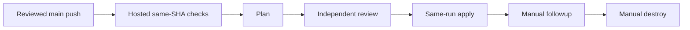

# Lab 07 · Step 2 — Observe a real instructor-enabled dev plan

**Goal:** Observe the real plan from an approved main push, then independent approval and exact-plan apply in that same run. Planning success is not approval.

| Working context | Selection |
| --- | --- |
| Repository / branch | One approved **private** writer / current protected `main` |
| Files | Read [module-lock.json](../../module-lock.json) and [environments/dev/main.tf](../../environments/dev/main.tf); no edits |
| Workflow | **Trusted dev delivery (instructor enablement required)** |
| Tools / event | Node **24.16.0**, Terraform **1.16.1**, AzureRM **5.4.0** / `push` to `main` selects `deploy` |

> [!WARNING]
> **Public templates remain inert. Live Lab 07 is not solo.** Only instructor authorization enables this private writer after preflight. No authoring cloud operations, learner enablement, local real backend/state access, identity creation or Copilot cloud tools.

Plain text: main push → credential-free validation → plan → independent `dev-apply` approval → same-run apply. **No second deploy dispatch.** Followup and destroy are separate manual requests; destroy needs a new plan and independent review. Do not reuse an earlier run's artifact.

## Do

### 1. Confirm every prerequisite with the instructor

Use [instructor preflight](../../docs/instructor-preflight.md) and [delivery configuration](../../docs/delivery-configuration.md), not an Exercise checkbox, to establish:

| Required boundary | Instructor confirmation |
| --- | --- |
| Writer and code | Exact private copy; protected current `main`; reviewed merged-PR association; approved sandbox/revision |
| Authoring and validation | [Required Step 1 tutorial](../../docs/workflow-authoring.md) completed while disabled; current PR checks; hosted delivery validation checks out `${{ github.sha }}` before `plan` can start |
| Identities | Distinct `AZURE_PLAN_CLIENT_ID` / `AZURE_APPLY_CLIENT_ID`: workload-RG Reader / Contributor; exact authorized OIDC subjects |
| Backend | Approved private account/container/key and runner DNS/routes; both identities have container-scoped **Storage Blob Data Contributor** for leases |
| Concurrency | One writer; state-specific `WS2_STATE_LOCK_ID`; no cancellation of active writers; blob locking enabled |
| Runner | Clean restricted allowed-workflow runner, labels `self-hosted`, `linux`, `x64`, `ws2-trusted`; PRs cannot use it |
| Environments | `dev-plan` / `dev-apply`: explicit branch-`main`-only policies; required independent `dev-apply` reviewers; self-review prevented; administrator bypass disabled |
| Reviewer | Neither run actor/triggering actor nor PR/deployed code author; required licensing/access actually available |
| Inputs and transport | Existing `WORKLOAD_RG`; approved `WORKLOAD_INPUTS_JSON` and locks; narrowly scoped module transport, never PR credentials |
| Encryption | Public key configured; decryption key restricted to `dev-apply` and approved reviewer escrow |

Missing any requirement? Keep `WORKSHOP_AZURE_ENABLED=false`, record **BLOCKED**, and stop. Never invent `main`, widen roles or replace independent approval with self-checking.

### 2. Observe the reviewed main push — do not dispatch deploy

Finish [the required workflow-authoring task](../../docs/workflow-authoring.md) on `lab/workflow-authoring` first. The existing complete workflow is the reference baseline, not an excuse to skip construction or to install a duplicate. Keep delivery disabled until the instructor has separately authorized the live window.

Coordinate one reviewed PR merge into protected `main`. If the original authoring PR was merged while disabled, its skipped run is not proof: a later authorized reviewed main push is required. In the approved copy, inspect **Code → main → latest commit**, then **Actions → Trusted dev delivery (instructor enablement required)** and open the run created by that push:

| Run field | Value / meaning |
| --- | --- |
| Event / branch | **push / main** — trusted reviewed code, not default `dev` or a PR head |
| SHA / attempt | Exact current main commit / **1** |
| Operation | `deploy`, selected by the existing push policy; the same run will wait for independent `dev-apply` approval |

Do not select **Run workflow** for deployment and never select **Re-run jobs**. Only `followup` and `destroy` remain in the manual menu; scheduled `drift` reports without applying. Read [Step 3's independent review procedure](03.md#4-independently-inspect-and-approve-the-exact-artifact) **before this first enabled merge**, so the reviewer is ready for this run's approval request.

*REFERENCE — GitHub, CC BY 4.0; CodeQL is an example label, not this workflow. [Attribution](../../docs/images/NOTICE.md).*

### 3. Inspect actual execution and protected artifacts

Require **Verify instructor gate configuration**, then **Validate reviewed delivery revision**, then **Trusted dev plan**, to succeed. Validation runs `npm test`, `kit:check`, `workflow:check` and the existing backend-disabled provider-mocked learner helper on hosted Ubuntu, without secrets/OIDC/trusted-runner access. Failure stops before privileged planning; an unrelated green PR run is not a substitute for this exact-SHA dependency.

In **Summary**, compare source/module/state/run/attempt/operation and inspect creates, updates, deletes, replacements and output caveats. The independent reviewer privately inspects the exact encrypted-plan contents and approves `dev-apply` using Step 3; **Apply reviewed dev plan** then resumes in this run without another dispatch. Never approve just to advance the Exercise.

| Terraform detailed exit | Meaning |
| --- | --- |
| `0` | Valid no-change plan; not the later follow-up checkpoint |
| `2` | Valid plan with changes; not approval |
| `1` | Error; stop |

Only an **AES-256-GCM / RSA-OAEP encrypted envelope** may be uploaded. Its run-specific identity and separate saved-plan/manifest SHA-256 digests bind review. Private readers can download ciphertext; privacy alone is not decryption protection. Plans expire after **2 hours**; **1 day** artifact retention does not extend validity. No keys, tokens, raw state, decrypted plans or sensitive screenshots in Git, issues or Chat. Sanitized addresses are not property-level review.

### 4. Check the Exercise gate

**Expected:** Refresh the existing issue after the **whole run completes**. AgentAlvine requires the actual same-repository delivery run on `main`, current observed SHA, attempt **1**, created after course start and no earlier than the preceding checkpoint, with **Trusted dev plan** successful. A plan still waiting for apply approval does not yet satisfy that completed-run gate. Old, queued, skipped or fixture jobs do not count; no run-ID submission, evidence PR or manual progress edit.

The historical checker accepts eligible push, dispatch and schedule records; it is not push-only. This lesson deliberately uses **push / main**. After this checkpoint is recorded, Step 3's review-note PR creates a **later main-push run** with its own fresh plan/apply; the earlier run cannot satisfy a later checkpoint's time boundary. The five gates and historical scores are unchanged.

The current driver checks scoped output IDs after apply, not real Azure configuration. Instructor-observed configuration and later cleanup inventory remain separate required live verification, never inferred from tests or job names.

**Recovery:** Comment **BLOCKED**, the sanitized failure category and instructor next action. Resolve missing access/runner/lease controls without public-backend workarounds, unlocks or privilege expansion; then use a new authorized run, never a credentialled rerun.

**Next:** [Step 3: independently reviewed deploy](03.md). Offline success cannot unlock it.
