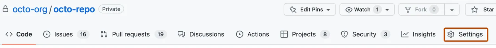

# Instructor preflight: keep live delivery blocked until proven

> [!WARNING]
> **INSTRUCTOR ONLY — reference, not participant authorization.** All live checks
> below are **unexecuted and blocked during documentation authoring**. Neither
> Copilot, AgentAlvine, a completed Exercise, a PR approval, nor this checklist
> authorizes Azure access. Do not provision identities, inspect state, change a
> subscription, or dispatch delivery while authoring these documents.

**Start:** [start-here.md](start-here.md) · **Setup help:** [troubleshooting.md](troubleshooting.md)

## 1. Know which repository and which kind of proof

The source is the **public template**
[alvinea28/ws2-azure-delivery-laboratory-07](https://github.com/alvinea28/ws2-azure-delivery-laboratory-07).
Keep that template inert: no live enablement, deployment credentials, or trusted
runner access. A **PRIVATE participant copy is mandatory for live delivery**.
Public source code does not make a public deployment repository acceptable.

This lab is standalone. Its complete [../module/](../module/) and verified
[../vendor/network-baseline/](../vendor/network-baseline/) provide the network
baseline and subnet-security child module. No other laboratory is required.
Publishing and repinning this same repository's module is maintainer preparation,
not evidence that a participant completed a module-release exercise.

| Evidence class | What it establishes | What it cannot establish |
| --- | --- | --- |
| Local source/hash review | Supplied files agree with the snapshot record | A published Git revision, usable credentials, or Azure readiness |
| Provider-mocked learner checks | Consumer contracts and rejection cases execute without a backend | Real OIDC, RBAC, DNS, leases, or deployed resources |
| GitHub settings verification | The actual private copy has enforceable gates | That a saved plan was reviewed or applied |
| Authorized instructor dry run | Observed integration results for that exact copy and sandbox | Permission for another copy, state, operation, or future run |

## 2. Arrange people, accounts, and a suitable private host

| Responsible human | Responsibility before the live window |
| --- | --- |
| Repository/organization administrator | Private copy, protected `main`, required checks, environments, runner-group restrictions |
| Azure instructor | Approved existing sandbox, distinct identities, scoped roles, private backend, connectivity, recovery ownership |
| Source reviewer | Review the latest Git diff and checks before changes enter protected `main` |
| Independent deployment reviewer | Inspect this run's decrypted plan privately; approve neither their own code nor a run they initiated |
| Participant | Complete offline tasks, propose changes, and stop at missing instructor prerequisites |

The run initiator, triggering actor, and associated merged-PR author are excluded
from the apply approver check. A push-triggered run can make the merger its
initiator. Arrange a third eligible human when the author/merger combination
leaves no independent reviewer; never fabricate an account or approval.

GitHub's private-repository features depend on the actual plan. Creating an
environment does **not** prove required reviewers or selected-workflow runner
access are available. If they are unavailable, the instructor must arrange an
adequately licensed private copy and designate it the **only state writer**.
Do not make the copy public, replace approval with dispatch, or leave two writers.

## 3. First-time setup, without touching Azure

1. In the browser, check the personal GitHub account and accepted organization invitation.
2. Follow [start-here.md](start-here.md) to create the assigned **Private** copy.
3. In desktop VS Code, use **Ctrl+Shift+P → Git: Clone** for that copy, then **Open**.
4. Check **Explorer**, **Source Control**, and the terminal location: all must identify this one clone.
5. Check VS Code **Accounts** and Copilot entitlement separately from Git credentials and commit authorship.
6. Follow [toolchain.md](toolchain.md): Node **24.16.0**, Terraform **1.16.1**, AzureRM **5.4.0**.
7. Use **Terminal → New Terminal** at the clone root for the approved offline commands below.

```powershell
node scripts/doctor.mjs
node scripts/check-learner.mjs
```

Run each command separately and stop at the first failure. The doctor checks
local readiness; it does not authenticate or configure anything. The learner
helper validates vendored hashes, creates a disposable test root, omits the
canonical backend, and uses provider mocks with backend-disabled initialization.
Provider downloads may use the internet; no Azure login or remote state is needed.

**Expected result:** required positive and rejection tests actually execute.
Zero, skipped, errored, or merely anticipated tests are not a pass. The supplied
consumer suite defines two required cases. This authoring task did not run those
Terraform cases or the helper that creates the disposable root.

## 4. Configure GitHub deliberately



*REFERENCE — unmodified GitHub documentation example, CC BY 4.0. This identifies
navigation only, not actual workshop settings or Azure configuration. [images/NOTICE.md](images/NOTICE.md).*

Open the **private copy → Settings**, not personal account settings or the public
template. If the tab is hidden, check the navigation **…** menu; if access is
missing, ask its administrator rather than granting yourself broader rights.

Use [delivery-configuration.md](delivery-configuration.md) in this order:

1. Keep `WORKSHOP_AZURE_ENABLED` explicitly `false` in repository Actions variables.
2. Have the instructor establish `main`, make it the copy's default, and enforce PR reviews/checks.
3. Create `dev-plan` and `dev-apply` before use; permit only the **branch** `main`.
4. Verify independent environment review, **Prevent self-review**, and no administrator bypass.
5. Restrict the runner group to this private copy's exact delivery workflow at protected `main`.
6. Place repository variables and environment secrets in their distinct locations.
7. Review the same-repository module pin and the still-required GitHub App transport.

**Stop:** a default branch is not a protected branch; a runner label is not an
access policy; a successful public clone is not live module-transport proof.

## 5. Obtain the instructor-owned infrastructure prerequisites

These are responsibilities for a **separately approved** portal/private-workstation
preflight, not tasks for Copilot or participants to execute now.

| Prerequisite | Required proof retained privately | Stop condition |
| --- | --- | --- |
| Sandbox and workload | Approved existing workload RG, region, network ranges, registered providers | Missing owner, scope, policy approval, or provider registration |
| Plan identity | Workload-RG **Reader**, distinct from apply | Contributor/Owner granted to make planning work |
| Apply identity | **Contributor** on the assigned workload RG only | Subscription-wide or role-assignment authority |
| State access | Both identities: team-container **Storage Blob Data Contributor** | Blob Data Reader only, storage-key fallback, or cross-team scope |
| Federation | Exact actual issuer/audience/subject match for each environment | Guessed subject, wildcard broadening, or token logging |
| Private backend | Approved account/container/key, recovery policy, DNS/routes/TLS, lease behavior | Public-storage workaround, unknown active writer, or state download as a test |
| Runner | Ephemeral Linux x64, exact-workflow restriction, cleanup, no ambient identity | PR or alternate-branch code can select a privileged runner |
| Plan review | RSA key custody and an independent reviewer with approved private workstation | Decryption key available to PRs or plaintext ordinary artifacts |

See [identity-state.md](identity-state.md) for portal navigation and the difference
between workload rights, state data rights, and GitHub transport credentials.

## 6. Keep the enablement decision honest

`WORKSHOP_AZURE_ENABLED` stays `false` for authoring and participant use until the
instructor has real, approved dry-run evidence and issues the go/no-go decision.
Documentation, synthetic tests, skipped jobs, and screenshots cannot supply it.

There is an important bootstrap constraint: the shipped workflow's own preflight
also requires this variable to be `true`. It cannot perform a real dry run while
the flag is `false`. The **first instructor-only rehearsal needs its own explicit
enablement authorization and controlled window**; this page grants neither.
Until that decision exists, leave the flag `false` and all live acceptance pending.

In that future window, follow [plan-review.md](plan-review.md) for a plan, a newly
planned deployment, a separately requested `followup`, report-only drift, and a
separately approved destroy. Never reuse a plan-only artifact for deployment.
Every credentialled retry needs a **new run**, not **Re-run jobs**.

## 7. Source-inspection findings and final handoff

| Authoring finding | Status and required owner action |
| --- | --- |
| Complete local module and vendored baseline | Read-only comparison verified all eight HCL files against the current lock; not cloud proof |
| New public same-repository pin | Pending actual published 40-character revision and coordinated source/subdirectory/hash refresh |
| Git-object provenance | Current refresh helper checks HEAD/origin/tracked files, but does not compare export bytes with Git objects; maintainer correction is required |
| Offline quality regression | [../tests-node/toolchain.test.mjs](../tests-node/toolchain.test.mjs) currently reads an absent validation workflow; read-only reproduction: 0 passed, 1 failed |
| Public module transport | Existing live GitHub App read path is unchanged and must be proven, or separately changed/retested by the maintainer |
| Private gates and Azure integration | Unexecuted; no successful deployment, follow-up, drift, or cleanup claimed |

Keep an instructor-owned **private acceptance record** of verifier, date, exact
reviewed revision, observed result, and unresolved owner/action. Do not add actual
IDs, secrets, private evidence links, or unredacted screenshots to these public
reference pages. This is not a learner evidence-PR or manual progress protocol.
AgentAlvine continues to update the existing Exercise body automatically.

Cleanup acceptance must retain the shared RG, backend/container, identities,
roles, and runner with named human owners. Use [recovery.md](recovery.md) for
uncertain writers or failures; never force-unlock an active lease.

## Source attribution

Contract facts were checked against [../.github/workflows/delivery.yml](../.github/workflows/delivery.yml),
[../scripts/delivery.mjs](../scripts/delivery.mjs), [../scripts/plan-policy.mjs](../scripts/plan-policy.mjs),
and [../scripts/approval.cjs](../scripts/approval.cjs). This explanatory text is original.
For feature availability, consult [GitHub environment documentation](https://docs.github.com/en/actions/how-tos/deploy/configure-and-manage-deployments/manage-environments).
Image source URLs and licensing are retained in [images/NOTICE.md](images/NOTICE.md)
and [images/manifest.json](images/manifest.json).
