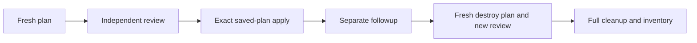

# Plan review: bind one decision to one encrypted plan

> [!WARNING]
> **INSTRUCTOR ONLY.** Templates inert; **PRIVATE writer**, `WORKSHOP_AZURE_ENABLED=false`
> until [preflight](instructor-preflight.md). No authoring Azure/identity/state/subscription
> operations/decryption. Copilot, PR approval and AgentAlvine never authorize Azure.

**Setup once:** [start-here.md](start-here.md) · **Settings:** [delivery-configuration.md](delivery-configuration.md) · **Recovery:** [recovery.md](recovery.md)

## 1. Understand events and operations

Workflow: **Trusted dev delivery (instructor enablement required)**, baseline only.
First complete [required offline workflow construction](workflow-authoring.md).
All live routes: **Verify instructor gate configuration → Validate reviewed delivery
revision → Trusted dev plan** at the same checked-out event SHA.

| Do | Why | Expected |
| --- | --- | --- |
| Reviewed enabled **main push** → `deploy` | Plan, independent approval, then same-run mutation | **Apply reviewed dev plan**, no second dispatch |
| Manual `followup` (menu default) | Verify | **Confirm no-change**, separate exit 0 |
| Manual `destroy` | Full cleanup/new review | **Destroy reviewed dev plan** |
| Schedule → `drift` | Report only | Exit 2 → **Report drift without applying** |

Protected default `main`; schedule Tuesday **02:17 UTC**. Only followup/destroy
are manual menu options. No duplicate requests; dispatch is not independent approval.



Flow: plan → review → exact apply → separate followup → newly reviewed destroy → inventory.

## 2. Find the exact run in GitHub


*Unmodified GitHub references, not live proof. [CC BY 4.0](images/NOTICE.md).*

| Do | Why | Expected |
| --- | --- | --- |
| Actions → delivery (not CodeQL) → run from reviewed merge | Deployment | **push / main**, exact current SHA, attempt **1**; no second deploy dispatch |
| Run workflow → main → followup or destroy | Separately authorized verification/cleanup | New run, attempt **1** |
| Read preflight/validation/plan → Summary | Verify | All three successful; inventory, both digests; otherwise stop |

## 3. Interpret Terraform's detailed plan result correctly

**0:** no-change (separate followup only; drift report skipped). **2:** changes,
even output-only; followup fails, drift reports. **1**/signal/missing/unexpected:
stop—no mutation or cleanup credit.

## 4. Review the encrypted artifact on an approved human workstation

Plans contain state: upload **ciphertext only**, AES-256-GCM; random key wrapped
RSA-OAEP/SHA-256, RSA **≥3072 bits**. Planning gets public key only; PRs/readers
never receive plaintext/decryption keys. Retention **1 day** ≠ validity **2 hours**.

Independent reviewer: restricted workstation/ACLs, trusted non-PR checkout.
**This run/attempt → Summary → Artifacts**: approved-channel ciphertext download:

```text
.workshop/sealed/plan.enc          input: downloaded ciphertext
.workshop/private/reviewed.tfplan  output: plaintext binary plan
.workshop/private/manifest.json    output: plaintext manifest
```

**Why:** paths, not commands; private/uncommitted outputs.

From that checkout root:

```powershell
$env:PLAN_KEY_PATH = Read-Host 'Approved escrowed private-key FILE PATH, never key text'
node scripts/plan-envelope.mjs open
```

**Why:** `Read-Host`: process key-file path only. `node` runs the [helper](../scripts/plan-envelope.mjs);
`open` decrypts. `PLAN_DECRYPTION_PRIVATE_KEY`: unset locally, **dev-apply only**,
separate human escrow. Stop on failure.

Verify [bindings](#5-verify-the-binding-not-merely-a-matching-filename); inspect properties/outputs using prepared schemas. Missing tooling:
stop—no backend init/new Azure plan/state retrieval. Remove plaintext/downloads/
`PLAN_KEY_PATH` per workstation policy; retain sanitized private decision/escrow.
No plaintext/keys in chat.

## 5. Verify the binding, not merely a matching filename

| Do | Why | Expected |
| --- | --- | --- |
| Match request | Scope | Repository/SHA/run/attempt **1**/operation; [canonical root](../environments/dev/main.tf), `dev`, default workspace |
| Match approved sandbox/state | Isolation | Tenant/subscription/RG, distinct OIDC plan/apply principals, exact account/container/key |
| Match dependencies | Provenance | Module repository/revision/subdirectory/source/inventory/hashes, installed snapshot, provider-lock/serialized-input digests; Terraform **1.16.1**, AzureRM **5.4.0** |
| SHA-256 binary/manifest bytes | Integrity | Both trusted plan-job digests, not archive hashes; manifest's plan hash agrees |
| Recheck age/main after approval/init, immediately before mutation | Freshness | Nonfuture age ≤**2 hours**, unchanged protected main |

Settings, not manifest fields: same-run artifact, restricted Linux x64 **exact-workflow**
runner, stale-state checks/Blob leases. Changed main/inputs/source/locks/state:
**fresh plan/review**; never edited digests, substituted artifacts or implicit replan.

## 6. Approve only after property-level human review

Review VNet/subnet/NSG/rules/associations and outputs, not mock counts. Reject
unexpected CIDRs/ingress, lost associations, replacements/shared-resource actions.
Destroy: workload **deletes/no-ops only**.

**Same run → Review deployments → dev-apply → Approve and deploy** (or reject).
Required reviewers, **Prevent self-review**, no administrator bypass, main-only.
Exclude run/triggering actor and merged-PR/code author; no bots/comments.
The job verifies approval history/merged-main PR association.

After approval: decrypt/check/init with [correct identity](identity-state.md),
reverify source/main/age/digests, apply **same saved binary in this run**.
No new deploy dispatch or implicit replanning occurs after approval.

## 7. Verify results without declaring premature completion

| Do | Why | Expected |
| --- | --- | --- |
| Verify apply output-IDs/instructor inventory | Scope | Correct topology |
| Separate `followup` | No-change | Exit 0 **and Confirm no-change** success |
| New independently approved full `destroy` | Mandatory cleanup | Same root/state; no targets |
| Verify plan/destroy success | Closure | Empty managed state **and** final private inventory; shared RG/backend/identities/roles/runner retained with owners |

Uncertain/failed cleanup stays open. No state deletion/local apply/destroy.
Credentialled retry: **new authorized run**, never **Re-run jobs**. Deployment uses
a newly reviewed main push; followup/destroy use a fresh authorized manual request.
The driver checks scoped output IDs and named topology, not actual Azure configuration;
destroy checks state emptiness, not final Azure absence. Instructor inventory is separate.

## Source attribution

[Workflow](../.github/workflows/delivery.yml), [policy](../scripts/plan-policy.mjs),
[delivery](../scripts/delivery.mjs), [approval](../scripts/approval.cjs), [envelope](../scripts/plan-envelope.mjs).
Images: [notice](images/NOTICE.md)/[manifest](images/manifest.json); no publisher rerun exception.
