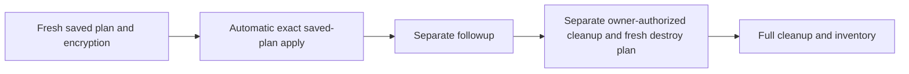

# Saved-plan integrity: bind one authorized run to one encrypted plan

> [!WARNING]
> **INSTRUCTOR ONLY.** Templates inert; **PRIVATE writer**, `WORKSHOP_AZURE_ENABLED=false`
> until [preflight](instructor-preflight.md). No authoring Azure/identity/state/subscription
> operations/decryption. Copilot, PR approval and AgentAlvine never authorize Azure.

**Setup once:** [start-here.md](start-here.md) · **Settings:** [delivery-configuration.md](delivery-configuration.md) · **Recovery:** [recovery.md](recovery.md)

## 1. Understand events and operations

Workflow: **Trusted dev delivery (instructor enablement required)**, baseline only.
First complete [required offline workflow construction](workflow-authoring.md).
Delivery: **Verify scoped dev deployment policy → Validate reviewed delivery
revision → Trusted dev plan** at the same checked-out event SHA.
Cleanup instead begins with **Verify separate dev cleanup authorization** in its
[dedicated workflow](../.github/workflows/cleanup.yml).

| Do | Why | Expected |
| --- | --- | --- |
| Reviewed enabled **main push** → `deploy` | Validation, saved plan/encryption, automatic same-run mutation | **Apply exact dev saved plan**, no manual reviewer or second dispatch |
| Manual `followup` (menu default) | Verify | **Confirm no-change**, separate exit 0 |
| Separate explicit admin dispatch of cleanup | Owned-scope full cleanup with a fresh exact destroy plan | **Apply exact authorized dev destroy plan** |
| Schedule → `drift` | Report only | Exit 2 → **Report drift without applying** |

Offline default remains **dev**; schedule Tuesday **02:17 UTC** runs on the default
branch. The owner deliberately selects protected main only when ready, not
automatically. Delivery's manual menu is **followup only**. Cleanup has a required
authorization string, no operation input. Ordinary main never cleans up.



Flow: validation → saved plan/encryption → automatic exact apply → separate
followup → owner-authorized dedicated cleanup → inventory. AgentAlvine observes,
never executes cloud operations or grants authorization.

## 2. Find the exact run in GitHub


*Unmodified GitHub references, not live proof. [CC BY 4.0](images/NOTICE.md).*

| Do | Why | Expected |
| --- | --- | --- |
| Actions → delivery (not CodeQL) → run from reviewed merge | Deployment | **push / main**, exact current SHA, attempt **1**; no second deploy dispatch |
| Delivery → Run workflow → main → followup | Fresh no-change verification | New run, attempt **1** |
| Cleanup → Run workflow → main → authorization | Separately authorized owned-scope cleanup by current repo admin | New run, attempt **1**, exact authorization string |
| Read preflight/validation/plan → Summary | Verify | All three successful; inventory, both digests; otherwise stop |

## 3. Interpret Terraform's detailed plan result correctly

**0:** no-change (separate followup only; drift report skipped). **2:** changes,
even output-only; followup fails, drift reports. **1**/signal/missing/unexpected:
stop—no mutation or cleanup credit.

## 4. Optional owner inspection on an approved workstation

Plans contain state: upload **ciphertext only**, AES-256-GCM; random key wrapped
RSA-OAEP/SHA-256, RSA **≥3072 bits**. Planning gets public key only; PRs/readers
never receive plaintext/decryption keys. Retention **1 day** ≠ validity **2 hours**.

No human deployment-review gate exists. An owner may separately authorize private
inspection/recovery; it must not be treated as a prerequisite that pauses automatic
apply. Do not perform decryption during local authoring/tests. Use a restricted
workstation/ACLs and trusted non-PR checkout only in that authorized context.
**This run/attempt → Summary → Artifacts**: approved-channel ciphertext download:

```text
.workshop/sealed/plan.enc          input: downloaded ciphertext
.workshop/private/reviewed.tfplan  output: plaintext binary plan
.workshop/private/manifest.json    output: plaintext manifest
```

**Why:** paths, not commands; private/uncommitted outputs.

From that checkout root:

```powershell
$env:PLAN_KEY_PATH = Read-Host 'Approved escrowed private-key FILE PATH, never key text'
node scripts/plan-envelope.mjs open
```

**Why:** `Read-Host`: process key-file path only. `node` runs the [helper](../scripts/plan-envelope.mjs);
`open` decrypts. `PLAN_DECRYPTION_PRIVATE_KEY`: unset locally, **dev-apply only**,
separately controlled owner escrow. Stop on failure.

Verify [bindings](#5-verify-the-binding-not-merely-a-matching-filename); inspect properties/outputs using prepared schemas. Missing tooling:
stop—no backend init/new Azure plan/state retrieval. Remove plaintext/downloads/
`PLAN_KEY_PATH` per workstation policy; retain sanitized private observations.
No plaintext/keys in chat.

## 5. Verify the binding, not merely a matching filename

| Do | Why | Expected |
| --- | --- | --- |
| Match request | Scope | Immutable repository ID/name, workflow ref, SHA/run/attempt **1**/operation; [canonical root](../environments/dev/main.tf), `dev`, default workspace |
| Match approved sandbox/state | Isolation | Tenant/subscription/RG, distinct OIDC plan/apply principals, exact account/container/key and state lock ID |
| Match dependencies | Provenance | Module repository/revision/subdirectory/source/inventory/hashes, installed snapshot, provider-lock/serialized-input digests; Terraform **1.16.1**, AzureRM **5.4.0** |
| SHA-256 binary/manifest bytes | Integrity | Both trusted plan-job digests, not archive hashes; manifest's plan hash agrees |
| Recheck age/main after authorization/init, immediately before mutation | Freshness | Nonfuture age ≤**2 hours**, unchanged protected main |

Settings, not manifest fields: same-run artifact, restricted Linux x64 **exact-workflow**
runner, stale-state checks/Blob leases. Changed main/inputs/source/locks/state:
**fresh authorized run/plan**; never edited digests, substituted artifacts or implicit replan.

## 6. Observe scoped authorization and exact-plan application

Understand VNet/subnet/NSG/rules/associations and outputs, not mock counts. Reject
unexpected CIDRs/ingress, lost associations, replacements/shared-resource actions.
Destroy: workload **deletes/no-ops only**.

**No Required reviewers** in either main-only environment; no admin bypass or
manual deployment reviewer. The historical [approval.cjs](../scripts/approval.cjs)
delegates to [deployment-authorization.cjs](../scripts/deployment-authorization.cjs),
not the approvals API. It freshly checks private **1379149907** and the exact
**alvine-aurelio-org/ws2-sim-20260921-azure-delivery-laboratory-07** name, live rules,
current main/run/SHA/attempt, actual merged PR, environments and successful same-run
validation/plan. Wrong IDs/public/templates fail. The PR author may merge after
strict checks and resolved conversations; zero approvals is not self-approval.

After scoped authorization: decrypt/check/init with [correct identity](identity-state.md),
reverify source/main/age/digests and automatically apply **the same saved binary in
this run**. No second dispatch, reviewer wait or implicit replanning.

Cleanup needs a separate current authenticated repo admin's explicit owned-scope
authorization and dispatch: `destroy:1379149907:<current full main SHA>:<WS2_STATE_LOCK_ID>`
in required **string** input `authorization`, no operation input. Admin permission,
actor/sender/trigger IDs, current SHA/state and that run's validated exact destroy
plan are checked. One authorized owner suffices; no independent cleanup reviewer.
Same state/concurrency/environments/identities; never shared RG/backend/identity/runner deletion.

## 7. Verify results without declaring premature completion

| Do | Why | Expected |
| --- | --- | --- |
| Verify apply output-IDs/instructor inventory | Scope | Correct topology |
| Separate `followup` | No-change | Exit 0 **and Confirm no-change** success |
| New separately owner-authorized dedicated cleanup | Mandatory full destroy | Same root/state; no targets |
| Verify plan/destroy success | Closure | Empty managed state **and** final private inventory; shared RG/backend/identities/roles/runner retained with owners |

Uncertain/failed cleanup stays open. No state deletion/local apply/destroy.
Credentialled retry: **new authorized run**, never **Re-run jobs**. Deployment uses
a newly reviewed main push; followup uses delivery and cleanup its dedicated
explicit owner-authorized manual request.
The driver checks scoped output IDs and named topology, not actual Azure configuration;
destroy checks state emptiness, not final Azure absence. Instructor inventory is separate.

## Source attribution

[Workflow](../.github/workflows/delivery.yml), [policy](../scripts/plan-policy.mjs),
[delivery](../scripts/delivery.mjs), [approval](../scripts/approval.cjs), [envelope](../scripts/plan-envelope.mjs).
Images: [notice](images/NOTICE.md)/[manifest](images/manifest.json); no publisher rerun exception.
