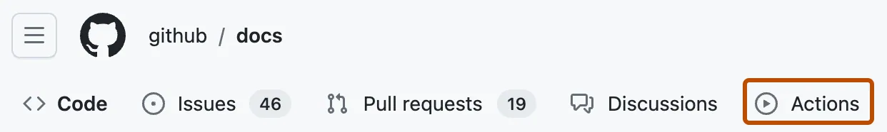

# Recovery: stop safely, diagnose narrowly, start a new run

> [!WARNING]
> **INSTRUCTOR ONLY — reference, not participant authorization.** No live recovery,
> Azure operation, identity change, state access, or subscription change was
> performed during authoring. All live acceptance remains **unexecuted/blocked**.
> Keep `WORKSHOP_AZURE_ENABLED=false` until instructor readiness is established;
> a failure, a green Exercise, or an AI suggestion cannot authorize a workaround.

**First-time setup:** [start-here.md](start-here.md) · **Local issues:** [troubleshooting.md](troubleshooting.md)
**Gate checklist:** [instructor-preflight.md](instructor-preflight.md)

## 1. Decide whether this is offline setup or an actual live incident

The public source
[alvinea28/ws2-azure-delivery-laboratory-07](https://github.com/alvinea28/ws2-azure-delivery-laboratory-07)
is an inert template. A **PRIVATE copy** is mandatory for live delivery. An
unfinished offline task or a disabled/skipped workflow is not a cloud incident
and does not need Azure access to diagnose it.

| What you observe | Where to start | Do not do |
| --- | --- | --- |
| Wrong account, clone, branch, or missing tools | [troubleshooting.md](troubleshooting.md) and [toolchain.md](toolchain.md) | Change Azure settings or run delivery to test sign-in |
| Snapshot/consumer mock failure | [dependency-snapshot.md](dependency-snapshot.md), actual diff and test error | Invent hashes, fetch state, or initialize the canonical backend |
| Missing private gates or trusted runner | [delivery-configuration.md](delivery-configuration.md), with the administrator | Make the copy public or substitute a label for runner policy |
| Authorized live run failed or stalled | Preserve limited metadata, then follow the incident steps below | Rerun credentialled jobs or start a competing writer |

Every laboratory is independent. This repository already contains its complete
module and offline snapshot; obtaining another laboratory is not a recovery step.

## 2. Find the failing job without publishing sensitive logs

1. In the private copy's browser page, select **Actions**.
2. Select **Trusted dev delivery (instructor enablement required)** in the sidebar.
3. Open the **exact** affected run, not the newest green run with a similar title.
4. Check event, operation, commit, attempt, queue/running/completed status, and failing job.
5. Read the sanitized summary/error category first. Do not export full logs or download artifacts as a generic diagnostic.
6. Tell the instructor if an apply/destroy might still be active; uncertainty itself is a stop condition.

*REFERENCE — unmodified GitHub navigation example, CC BY 4.0. It does not show a
workshop incident, configured Azure service, or successful recovery. [images/NOTICE.md](images/NOTICE.md).*

| Exact job | First question |
| --- | --- |
| **Verify instructor gate configuration** | Is this the private copy's current protected `main`, with real environment policies and attempt 1? |
| **Trusted dev plan** | Did source transport, OIDC, backend, validation, planning, or encryption fail? |
| **Apply reviewed dev plan** | Did approval/binding verification stop before mutation, or could apply have started? |
| **Destroy reviewed dev plan** | Did deletion start, and was empty workload state actually confirmed? |
| **Confirm no-change** | Was the separate fresh plan exit 0, or were changes detected? |
| **Report drift without applying** | Did the report-only issue update succeed? No remediation is part of this job. |

Keep only a short sanitized error, code/module revision, job, operation, and
run/attempt reference in the approved private incident channel. Do not place
actual IDs, backend values, private evidence links, full plan JSON, or state in
these public documents. A missing summary does not mean zero resources changed.

## 3. Establish writer status before changing anything

1. The instructor checks Actions status and the assigned ephemeral runner's process state through approved administration.
2. Identify the one writer repository and intended account/container/key privately.
3. Check whether an earlier plan, apply, or destroy still owns the lease; elapsed time alone proves nothing.
4. Keep the existing state-specific concurrency and `cancel-in-progress: false`.
5. Do not cancel a running mutation merely to shorten a queue. A failed/disconnected UI can coexist with unfinished provider work.
6. If writer or state consistency is uncertain, pause new dispatches and escalate to the instructor's incident process.

The enablement flag is an admission gate, **not an emergency kill switch** for an
already-running process. Do not assume changing it stops a writer or releases a
lease. GitHub concurrency is repository-scoped; a second repository with the same
lock identifier is still a second writer.

## 4. Diagnose at the failed boundary

| Symptom | Evidence the instructor compares privately | Smallest safe next action / stop condition |
| --- | --- | --- |
| Public-source module fetch fails | Pinned repository/revision/subdirectory; App installation and Contents-read scope; required token availability | Correct only approved transport/configuration. Public availability does not bypass the unchanged App path. |
| Snapshot/source mismatch | Canonical source, lock record, eight-file HCL inventory, approved Git objects | Stop; refresh the whole approved set through review, not hand-edited digests. |
| OIDC trust mismatch | Actual allowlisted issuer/audience/subject/context against the intended identity | Instructor repairs exact federation under separate authority; no wildcard trust, JWT logging, or client-secret fallback. |
| Workload authorization denied | Requested operation, plan/apply identity, workload RG, inherited/direct roles | Preserve plan Reader and RG-only apply Contributor; do not grant subscription rights for registration or convenience. |
| Backend authorization denied | Entra data-plane auth, team-container scope, both Blob Data Contributor assignments | Correct the scoped role/auth mapping; no storage-key lookup, access key, or SAS fallback. |
| Wrong/public DNS address or name failure | Trusted runner's resolver, private DNS link, account endpoint | Instructor corrects the narrow DNS path; no public-storage workaround. |
| Private address but TLS timeout | Route, firewall, private endpoint, TLS trust, runner network | Diagnose connectivity separately from RBAC; never disable certificate checks. |
| Lease conflict | Actual active writer/process, state tuple, other repositories, backend ownership | Coordinate with the writer; no active force-unlock, lease break, or lock disabling. |
| Missing/stale/tampered encrypted plan | Same-run artifact source, plan/manifest digests, timestamp, bindings, current `main` | Reject; use a new run and new review. Never rename a different artifact or extend validity. |
| Approval rejected | Real environment approval history, eligible human, associated merged-main PR, current branch | Obtain legitimate review for a fresh run; comments, self-review, reruns, or admin bypass are insufficient. |
| Apply/destroy lost connection or failed part-way | Active operations and instructor-owned state consistency assessment | Treat mutation outcome as uncertain until proven; no blind replay, arbitrary import, or manual state edit. |
| `followup` or `drift` returned 2 | Actual desired-versus-observed property/output changes | Explain and review the difference. Only drift reports an issue automatically; neither operation auto-applies. |

Delivery emits a category, not unrestricted Terraform output. Similar messages
can have different causes: a 403 is not proof of one particular role fault, and
a timeout is not proof of bad credentials. Require evidence before changing scope.

## 5. Handle stale plans and partial mutations differently

**Rejected before mutation:** record the rejection, correct the smallest reviewed
input/source/configuration error, and request a **new** trusted run. Plans are valid
for **2 hours**, encrypted artifacts retained for **1 day**. Longer artifact
availability does not revive an expired plan or a moved-`main` approval.

**Mutation may have begun:** do not assume Git history describes current Azure
state. The instructor must establish that the writer has stopped and the backend
is consistent under the approved incident procedure. Only then can a fresh trusted
plan describe the remaining work for a new independent decision.

No local Azure plan/apply/destroy, state pull/show/download, manual Blob edit,
`-lock=false`, raw JWT printing, or private-key transfer through Copilot is a
permitted workaround. Never feed a decrypted saved plan into chat for diagnosis.

## 6. Escalate locks; do not teach a force-unlock shortcut

**Never force-unlock an active run.** For a lost runner, the instructor must prove
that all Terraform processes/writers for the state have stopped, identify the exact
lock/state privately, and obtain explicit incident authorization before exceptional
orphan-lock or backend-version recovery. No force-unlock command is supplied here.

The recovery owner records the rationale and outcome privately. Restoring a state
version can affect resource tracking and is not an ordinary source rollback.
After legitimate recovery, require a **fresh trusted plan**, actual property review,
and new independent approval for mutation; never revive a saved artifact.

## 7. Correct code through the reviewed Git route

1. In VS Code inspect the relevant workflow/script and the sanitized failure side by side.
2. Copilot may explain non-sensitive source and competing hypotheses; it must not connect to Azure or request state/credentials.
3. Make only an authorized source correction on the instructed task branch; preserve tests and security controls.
4. Follow [git-workflow.md](git-workflow.md) to save, review the diff, stage, commit, and push.
5. Request an instructor/nonauthor review into protected `main` with current required checks.
6. Use [plan-review.md](plan-review.md) for a **new** authorized run and independent review of its actual plan.

For a dependency rollback, keep source revision/subdirectory, snapshot hashes,
vendored files, and provider selection coherent through the approved PR.
A code revert does not reverse already-applied infrastructure. Do not use
**Re-run failed jobs** or **Re-run all jobs** for credentialled delivery; attempts
other than 1 are rejected to prevent historical approval reuse.

## 8. Close only what was actually verified

| Incident outcome | Minimum closure proof |
| --- | --- |
| Offline failure repaired | Relevant positive/rejection checks executed on the corrected revision; not cloud proof |
| Deployment repaired | New **Apply reviewed dev plan** success, private inventory confirmation, separately requested `followup` |
| No-change confirmed | New **Trusted dev plan** exit 0 and **Confirm no-change** success |
| Drift investigated | Cause, impact, owner, and reviewed desired-state decision; no automatic fix |
| Cleanup confirmed | New independently approved **Destroy reviewed dev plan**, no managed workload addresses, final private inventory check |

Retain the shared RG, backend account/container, identities, role assignments,
and runner with explicit instructor owners. Never delete a state blob to claim
cleanup. Unavailable gates, unknown resource health, and uncertain deletion remain
open; a skipped cloud job is not completed acceptance. AgentAlvine's automatic
Exercise updates do not replace this human responsibility.

## Source attribution

Original runbook grounded in [../scripts/delivery.mjs](../scripts/delivery.mjs),
[../scripts/approval.cjs](../scripts/approval.cjs), [../scripts/plan-policy.mjs](../scripts/plan-policy.mjs),
and [../.github/workflows/delivery.yml](../.github/workflows/delivery.yml).
Settings: [delivery-configuration.md](delivery-configuration.md); roles: [identity-state.md](identity-state.md).
Image license/source: [images/NOTICE.md](images/NOTICE.md). The publisher's rerun
navigation page does not override this lab's **no credentialled reruns** rule.
