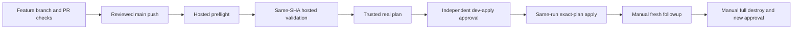

# Lab 07 · Construct the one protected delivery workflow

**Required core task in [Step 1](../.github/steps/01.md), continued in [Step 2](../.github/steps/02.md).** This is not an optional reading exercise or a new numbered course. You construct YAML, run rejection-tested local checks, and review the result before any separately authorized live merge.

**Goal:** construct [the canonical delivery workflow](../.github/workflows/delivery.yml) on `lab/workflow-authoring` while `WORKSHOP_AZURE_ENABLED=false`, then explain how one approved main push leads to planning, independent approval and same-run apply.

> [!WARNING]
> Offline authoring authorizes no Azure login, identity creation, backend/state access, subscription changes or real plan/apply/destroy. Public templates stay inert. Only the instructor-approved private writer can later perform separately authorized live work. Copilot, AgentAlvine, a green checker and Exercise progress never grant that authorization.

## 1. Open the right files; the supplied workflow is already complete

First use [start-here](start-here.md) for install/account/copy/clone/open instructions: your own **Private** copy, its own HTTPS clone URL, desktop VS Code, Node **24.16.0**, Terraform **1.16.1**, AzureRM **5.4.0**. No earlier laboratory or Azure account is needed offline. Already copied? Keep the same copy and Exercise.

1. In VS Code **Explorer**, confirm that this clone contains the workflow, [complete teaching reference](../solutions/delivery.yml), [checker](../scripts/check-workflow.mjs), and [identity map](../exercise/identity-map.md).
2. With a clean working tree on the actual default branch, normally `dev`, use **Ctrl+Shift+P → Git: Create Branch… → lab/workflow-authoring**. Preserve an existing learner branch and ask for synchronization help rather than resetting it. macOS uses **Cmd**.
3. The instructor confirms that the copy's repository variable `WORKSHOP_AZURE_ENABLED` remains **false**. Do not change it. Missing protected `main` or cloud prerequisites is normal for this offline phase; do not create an unprotected replacement.
4. Open the reference, then **Split Editor Right** and open the canonical workflow alongside it. The installed file is a **complete reference baseline**, not a missing learner file or evidence that you have already completed the task.

| Location | Meaning / permitted use |
| --- | --- |
| [.github/workflows/delivery.yml](../.github/workflows/delivery.yml) | The **only** installed Azure delivery entry point; preserve this exact filename |
| [solutions/delivery.yml](../solutions/delivery.yml) | Complete teaching source outside GitHub's workflow directory; GitHub cannot run it here |
| [scripts/check-workflow.mjs](../scripts/check-workflow.mjs) | Read-only exact-reference and workflow-inventory checks; never edit it to make your exercise pass |
| [exercise/identity-map.md](../exercise/identity-map.md) | Your role map and explanation of what you constructed; no real account IDs or secrets |

**Expected:** one canonical delivery file, not another main-push deployment file. Do not rename it, install the reference under another workflow name, or delete any guard. The guide and quality/learner workflows are reviewed companions, not additional Azure writers.


*REFERENCE — GitHub, CC BY 4.0; review navigation, not your PR or execution evidence. [Attribution](images/NOTICE.md).*

## 2. Construct the workflow in sections, without publishing partial YAML

Use **File → New Text File**, then the language selector → **YAML**. Construct in this **untitled editor buffer**; leave the complete installed workflow in place while learning. Do not save another file under the workflow directory and do not commit a partial scaffold.

Work through the following rows **in order**. Copy each complete section from the teaching reference into the buffer, preserving indentation, action SHA pins, comments and expressions. Explain its purpose before moving on. The section labels below are navigation markers, not replacement YAML snippets.

| Construct from the reference | Meaning to explain in your own words | Expected invariant |
| --- | --- | --- |
| From `name:` through the line `jobs:` | Events, minimal default permissions, single-writer concurrency and instructor-supplied variables | Only `push.branches: [main]`; manual options only `followup`/`destroy`; scheduled drift never applies; `permissions: {}`; no cancellation of an active writer |
| Entire `preflight:` job, stopping before `validation:` | Hosted metadata checks for the exact private, non-template, enabled, protected-main context | Current branch SHA, attempt 1, real environment protections, state concurrency ID and module lock are checked before anything privileged |
| Entire `validation:` job, stopping before `plan:` | Credential-free tests of **this same event SHA**, not an old PR result | Hosted Ubuntu; `contents: read`; no environment secrets, OIDC permission or trusted runner; pinned Node/Terraform; all four checks run |
| Entire `plan:` job, stopping before `apply:` | Distinct plan identity, fixed root/state, reviewed module transport and real saved-plan creation | `needs: [preflight, validation]`; `dev-plan`; only ciphertext uploaded after sealing; two separate digests; sensitive files cleaned |
| Entire `apply:` job, then entire `destroy:` job | Consume this run's exact plan only after independent `dev-apply` approval | Existing approval/encryption/current-main/age/scope helpers unchanged; same-run artifact; destruction selected explicitly, never by an ordinary push |
| Entire `followup:` job, then `drift:` to end of file | A separately requested fresh no-change result and scheduled report-only drift | Exit 0 required for followup; drift can report changes but cannot apply them |

Under `jobs:`, job keys use **two spaces**; job settings use **four**; steps preserve the reference's indentation. Do not insert a second `jobs:` block. If an unfamiliar helper appears, read its supplied implementation rather than replacing it with an inline cloud command.

After every section is present, compare the buffer with the reference. Only then replace the contents of the existing canonical workflow **in one save**, retaining all guards. Never remove guards incrementally from the installed file. Keep the reference and checker read-only.

**Expected:** the installed file matches the reference. An exact reconstruction may produce **no Git diff** for that file; that is correct. Do not invent a YAML change to manufacture evidence. In your identity map, explain:

- why `plan` must need successful `validation` as well as `preflight`;
- why `${{ github.sha }}` is checked out by every code-executing delivery job;
- why the reference outside the workflow directory is not another live writer;
- why main push → plan → independent `dev-apply` approval → **same-run apply** requires no second dispatch;
- why offline checks and output IDs are not real Azure configuration/cleanup proof.

**Recovery:** incomplete sections, changed indentation, mismatched pins or duplicate files mean stop and compare with the known reference. Preserve your work in the editor; do not relax the checker or any deployment control.

## 3. Check the constructed code locally, then through credential-free CI

From **Terminal → New Terminal** at this clone's root, run each line separately and stop on failure:

```powershell
npm test
npm run kit:check
npm run workflow:check
node scripts/check-learner.mjs
```

| Command | What it actually checks | Expected / recovery |
| --- | --- | --- |
| `npm test` | Node unit tests, including workflow acceptance/rejection and existing approval/policy/encryption tests; temporary Git-object fixtures are local only | All cases execute and pass; no cloud run or approval is created. Do not delete a failing test |
| `npm run kit:check` | Existing beginner lessons, local links, screenshot attribution and workflow credential boundaries | Pass; repair the actual source/link problem |
| `npm run workflow:check` | Independently pinned reference digest, exact canonical comparison, reviewed four-file workflow inventory and explicit control invariants | One delivery workflow plus three reviewed companions; no extra writer. Compare the reference, not a guessed YAML fix |
| `node scripts/check-learner.mjs` | Existing source/lock/vendor verification, disposable backend-disabled consumer, read-only provider lock and **two explicit provider-mocked test cases** | Both cases pass; zero/skipped tests are not proof. Registry downloads may need internet, never Azure credentials |

The workflow checker tolerates CRLF versus LF and a missing final newline only. It does **not** parse arbitrary YAML with regular expressions or certify semantically equivalent rewrites. A malformed or unknown workflow is rejected before it can be accepted as the reviewed design. Unknown workflows, even apparently harmless ones, require instructor review; they are not automatically classified as safe. Changing both the reference and installed file still fails the independent pin.

Workflow/control fingerprints exclude Markdown lessons, screenshots and historical scores. Pedagogical mirror/link checks are separate. Code review of the **checker, reference, helpers and workflow at the same SHA** remains necessary: a person who can change all of them could change the policy. This checker is not a security boundary against a repository administrator.

Author/instructor syntax verification also uses **actionlint 1.7.12** with the supplied runner configuration:

```powershell
actionlint -config-file .github/actionlint.yaml .github/workflows/delivery.yml solutions/delivery.yml
```

**Why:** these arguments select the actual installed YAML and non-runnable reference; actionlint supplies real YAML/Actions syntax validation. It does not log in, start jobs or verify Azure. If unavailable, use the approved toolchain installation route, not an unpinned download. On Windows, an npm PowerShell-policy error can use `npm.cmd` without changing machine execution policy.

Save, inspect **Source Control → Changes**, and stage only intended workflow/map changes. Publish `lab/workflow-authoring` to your copy using the [reviewed Git route](git-workflow.md). **Workshop quality** and **Lab checks** run on hosted runners without Azure credentials, OIDC, state or environment secrets. Never run PR code on `ws2-trusted`.

**Expected:** current-SHA CI passes while delivery stays disabled. The historical Step 1 check still grades the identity map; required workflow construction is checked by CI, not awarded a new point. A skipped delivery job is **not** a successful live step.

## 4. Hand off settings; do not invent cloud values

Use [the existing configuration table](delivery-configuration.md#5-repository-variables-the-variables-tab-not-secrets), not values copied from a trainer, screenshot or another lab:

| Who / location | Setting families and purpose |
| --- | --- |
| Instructor, repository **Actions → Variables** | Disabled enablement; single-writer lock ID; approved tenant/subscription; distinct plan/apply client IDs; fixed backend account/container/key; workload RG/inputs; module App client ID; plan-encryption **public** key |
| Custodian, `dev-plan` and `dev-apply` **Environment secrets** | `MODULE_APP_PRIVATE_KEY`: scoped short-lived module read access, required even for the supplied public source |
| Custodian, `dev-apply` **only** | `PLAN_DECRYPTION_PRIVATE_KEY`: unavailable until independent environment approval; separate controlled human review escrow |
| Instructor, branch/environments/runner group | Actual protected `main`, required checks/reviews, no bypass, main-only environments, private runner reachability and **exact-workflow** runner access |

The fixed root remains [environments/dev](../environments/dev/), using this custom **5.4.0** baseline, not Lab 02's AVM profile. Local Azure CLI sign-in is not Actions OIDC authentication. Offline authoring needs no cloud values at all. Do not change the fixed root, state ownership, module lock or policies to make tests pass.

## 5. Read the live sequence before the instructor enables anything



After separately authorized [instructor preflight](instructor-preflight.md), a reviewed merge creates a **push / main** run. Inspect that run, its exact SHA and attempt **1**. Hosted preflight and validation must succeed before the restricted runner can plan. The independent reviewer then inspects that run's decrypted plan privately and approves `dev-apply`; **the same run resumes apply automatically**. No second deploy button or deploy dispatch is needed or offered. A scheduled run is report-only drift; manual requests are only `followup` and `destroy`.

Scheduled drift is requested on the default branch each Tuesday at 02:17 UTC and is subject to the same enablement, private-copy and protected-main gates. While delivery is disabled, any scheduled delivery jobs skip; a skipped run is not drift or deployment evidence. Use the credential-free quality and learner checks for offline authoring feedback, not the weekly schedule.

**Timing matters:** before the first enabled merge, read [Step 3's review procedure](../.github/steps/03.md#4-independently-inspect-and-approve-the-exact-artifact). Step 2's existing grader waits for a completed eligible run, not just a plan that is still waiting for approval. After Step 2 is recorded, Step 3's review-note PR creates a **later reviewed main push** and fresh same-run plan/apply; its older run cannot be reused across the checkpoint. This preserves all five historical course gates without adding a second dispatch to any deployment.

After an approved apply, the driver checks output-ID scope and named topology. It does **not** independently query Azure to verify deployed configuration or final resource absence. The instructor must observe actual configuration, an approved harmless Terraform update through another reviewed main push, fresh no-change, and final cleanup inventory in a separately authorized live rehearsal. Mocks, screenshots of reference material and skipped jobs are not that proof.

**Recovery:** failed validation stops before credentials. Missing OIDC/RBAC/DNS/lease protections stays blocked; use [recovery](recovery.md), not wider roles or public state. Moved main, changed bindings or an expired plan requires a newly authorized reviewed main push and fresh independent review, never credentialled reruns or fake changes just to trigger a run. `followup`/`destroy` retries are new authorized manual runs. Preserve partial failures for instructor reconciliation.

**Next:** return to [Step 1](../.github/steps/01.md) to finish the offline handoff, then [Step 2](../.github/steps/02.md) only when its live prerequisites are actually satisfied. Full reviewed destruction after live work remains mandatory; retain shared RG/backend/identities/runner.
