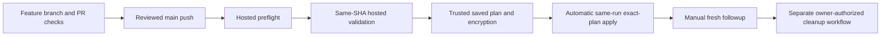

# Lab 07 · Construct the one protected delivery workflow

**Optional reference.** Required actions are inline in [Step 1](../.github/steps/01.md) through [Step 5](../.github/steps/05.md), not a separate activity. Follow that sequence once; do not repeat its tag update from this reference.

**Goal:** construct [the canonical delivery workflow](../.github/workflows/delivery.yml) on `lab/workflow-authoring` while `WORKSHOP_AZURE_ENABLED=false`, then explain how one approved main push leads to validation, saved plan/encryption and automatic same-run apply of those exact bytes.

> [!WARNING]
> Offline authoring authorizes no Azure login, identity creation, backend/state access, subscription changes or real plan/apply/destroy. Public templates stay inert. Only the instructor-approved private writer can later perform separately authorized live work. Copilot, AgentAlvine, a green checker and Exercise progress never grant that authorization.

**Scope and readiness:** only private non-template **alvine-aurelio-org/ws2-sim-20260921-azure-delivery-laboratory-07**, ID **1379149907**, is eligible. Wrong IDs/names, public templates and unapproved copies fail. Do not edit or repin the allowlist to enable another copy. No manual deployment reviewer is required; [owner authorization and verified configuration](delivery-configuration.md) are still prerequisites. This guide is a task, not a new readiness observation.

## Hands-on phase checklist — actions, not progress checkboxes

| Phase | Do / expected output | If blocked |
| --- | --- | --- |
| **Construct** | In VS Code, build header → preflight → validation → plan → automatic apply → followup/drift in an untitled YAML buffer; atomically replace the single canonical file while false | Compare complete sections with the non-runnable solution, never delete a guard |
| **Validate** | Run the four local checks below, then inspect credential-free CI at the current SHA | Repair source; no skipped/zero tests, secret-backed PR jobs or fabricated YAML changes |
| **Inspect readiness** | Owner and learner inspect the actual settings; owner authorizes target, budget/currency, lifetime and bootstrap, then verifies OIDC, state/leases, runner, encryption keys and module App | Keep false and default dev; absent main means offline handoff, not creation while unready |
| **Deploy automatically** | Once ready, author merges a passing PR into protected main; the same SHA is validated, planned, encrypted and applied without a reviewer wait | No second deploy button, approvals API or credentialled rerun |
| **Verify and update** | [Inspect real Azure configuration and make one benign HCL update](#6-hands-on-verify-configuration-and-make-a-benign-update); expect in-place update, no replacement and the same resource IDs | Output IDs and mocks alone are not configuration proof; stop on unexpected scope/actions |
| **Follow up and clean up** | Fresh `followup` exit 0; separately authorized current-admin cleanup with empty managed state plus Azure inventory | Ordinary main never cleans up; retain shared resources and keep uncertain cleanup open |

## 1. Open the right files; the supplied workflow is already complete

First use [start-here](start-here.md) for install/account/copy/clone/open instructions: your own **Private** copy, its own HTTPS clone URL, desktop VS Code, Node **24.16.0**, Terraform **1.16.1**, AzureRM **5.4.0**. No earlier laboratory or Azure account is needed offline. Already copied? Keep the same copy and Exercise.

1. In VS Code **Explorer**, confirm that this clone contains the workflow, [complete teaching reference](../solutions/delivery.yml), [checker](../scripts/check-workflow.mjs), and [identity map](../exercise/identity-map.md).
2. With a clean working tree on the actual default branch, normally `dev`, use **Ctrl+Shift+P → Git: Create Branch… → lab/workflow-authoring**. Preserve an existing learner branch and ask for synchronization help rather than resetting it. macOS uses **Cmd**.
3. The instructor confirms that the copy's repository variable `WORKSHOP_AZURE_ENABLED` remains **false**. Do not change it. Missing protected `main` or cloud prerequisites is normal for this offline phase; do not create an unprotected replacement.
4. Open the reference, then **Split Editor Right** and open the canonical workflow alongside it. The installed file is a **complete reference baseline**, not a missing learner file or evidence that you have already completed the task.

| Location | Meaning / permitted use |
| --- | --- |
| [.github/workflows/delivery.yml](../.github/workflows/delivery.yml) | The **only** installed Azure delivery entry point; preserve this exact filename |
| [solutions/delivery.yml](../solutions/delivery.yml) | Complete teaching source outside GitHub's workflow directory; GitHub cannot run it here |
| [.github/workflows/cleanup.yml](../.github/workflows/cleanup.yml) / [solutions/cleanup.yml](../solutions/cleanup.yml) | Separate installed cleanup and non-runnable reference; owner-authorized dispatch only, never a second push-driven deployer |
| [scripts/check-workflow.mjs](../scripts/check-workflow.mjs) | Read-only exact-reference and workflow-inventory checks; never edit it to make your exercise pass |
| [exercise/identity-map.md](../exercise/identity-map.md) | Your role map and explanation of what you constructed; no real account IDs or secrets |

**Expected:** one canonical delivery file, not another main-push deployment file. Do not rename it, install the reference under another workflow name, or delete any guard. The guide and quality/learner workflows are reviewed companions, not additional Azure writers.


*REFERENCE — GitHub, CC BY 4.0; review navigation, not your PR or execution evidence. [Attribution](images/NOTICE.md).*

## 2. Construct the workflow in sections, without publishing partial YAML

Use **File → New Text File**, then the language selector → **YAML**. Construct in this **untitled editor buffer**; leave the complete installed workflow in place while learning. Do not save another file under the workflow directory and do not commit a partial scaffold.

Work through the following rows **in order**. Copy each complete section from the teaching reference into the buffer, preserving indentation, action SHA pins, comments and expressions. Explain its purpose before moving on. The section labels below are navigation markers, not replacement YAML snippets.

| Construct from the reference | Meaning to explain in your own words | Expected invariant |
| --- | --- | --- |
| From `name:` through the line `jobs:` | Events, minimal default permissions, single-writer concurrency and instructor-supplied variables | Only `push.branches: [main]`; manual option **followup only**; scheduled drift never applies; `permissions: {}`; no cancellation of an active writer |
| Entire `preflight:` job, stopping before `validation:` | Hosted metadata checks for the exact private, non-template, enabled, protected-main context | Current branch SHA, attempt 1, real environment protections, state concurrency ID and module lock are checked before anything privileged |
| Entire `validation:` job, stopping before `plan:` | Credential-free tests of **this same event SHA**, not an old PR result | Hosted Ubuntu; `contents: read`; no environment secrets, OIDC permission or trusted runner; pinned Node/Terraform; all four checks run |
| Entire `plan:` job, stopping before `apply:` | Distinct plan identity, fixed root/state, reviewed module transport and real saved-plan creation | `needs: [preflight, validation]`; `dev-plan`; only ciphertext uploaded after sealing; two separate digests; sensitive files cleaned |
| Entire `apply:` job, stopping before `followup:` | Automatically consume this run's exact plan after scoped authorization, without a human reviewer | Authorization/encryption/current-main/age/scope helpers retained; same-run artifact; no `destroy` job in delivery |
| Entire `followup:` job, then `drift:` to end of file | A separately requested fresh no-change result and scheduled report-only drift | Exit 0 required for followup; drift can report changes but cannot apply them |

Under `jobs:`, job keys use **two spaces**; job settings use **four**; steps preserve the reference's indentation. Do not insert a second `jobs:` block. If an unfamiliar helper appears, read its supplied implementation rather than replacing it with an inline cloud command.

After every section is present, compare the buffer with the reference. Only then replace the contents of the existing canonical workflow **in one save**, retaining all guards. Never remove guards incrementally from the installed file. Keep the reference and checker read-only.

**Expected:** the installed file matches the reference. An exact reconstruction may produce **no Git diff** for that file; that is correct. Do not invent a YAML change to manufacture evidence. In your identity map, explain:

- why `plan` must need successful `validation` as well as `preflight`;
- why `${{ github.sha }}` is checked out by every code-executing delivery job;
- why the reference outside the workflow directory is not another live writer;
- why main push → validation → saved plan/encryption → automatic **same-run apply** requires no second dispatch;
- why dedicated cleanup is not part of delivery: required string `authorization`, no operation input, and a current authenticated admin's separate owned-scope decision;
- why offline checks and output IDs are not real Azure configuration/cleanup proof.

**Recovery:** incomplete sections, changed indentation, mismatched pins or duplicate files mean stop and compare with the known reference. Preserve your work in the editor; do not relax the checker or any deployment control.

## 3. Check the constructed code locally, then through credential-free CI

From **Terminal → New Terminal** at this clone's root, run each line separately and stop on failure:

```powershell
npm test
npm run kit:check
npm run workflow:check
node scripts/check-learner.mjs
```

| Command | What it actually checks | Expected / recovery |
| --- | --- | --- |
| `npm test` | Node unit tests, including workflow acceptance/rejection and authorization/policy/encryption tests; temporary Git-object fixtures are local only | All cases execute and pass; no cloud run or authorization is created. Do not delete a failing test |
| `npm run kit:check` | Existing beginner lessons, local links, screenshot attribution and workflow credential boundaries | Pass; repair the actual source/link problem |
| `npm run workflow:check` | Independently pinned reference digests, exact canonical comparisons, installed workflow inventory and explicit control invariants | One delivery workflow, one separate cleanup workflow and three credential-free/guide companions; no extra writer. Compare the references, not a guessed YAML fix |
| `node scripts/check-learner.mjs` | Existing source/lock/vendor verification, disposable backend-disabled consumer, read-only provider lock and **two explicit provider-mocked test cases** | Both cases pass; zero/skipped tests are not proof. Registry downloads may need internet, never Azure credentials |

The workflow checker tolerates CRLF versus LF and a missing final newline only. It does **not** parse arbitrary YAML with regular expressions or certify semantically equivalent rewrites. A malformed or unknown workflow is rejected before it can be accepted as the reviewed design. Unknown workflows, even apparently harmless ones, require instructor review; they are not automatically classified as safe. Changing both the reference and installed file still fails the independent pin.

Workflow/control fingerprints exclude Markdown lessons, screenshots and historical scores. Pedagogical mirror/link checks are separate. Code review of the **checker, reference, helpers and workflow at the same SHA** remains necessary: a person who can change all of them could change the policy. This checker is not a security boundary against a repository administrator.

Author/instructor syntax verification also uses **actionlint 1.7.12** with the supplied runner configuration:

```powershell
actionlint -config-file .github/actionlint.yaml .github/workflows/delivery.yml solutions/delivery.yml .github/workflows/cleanup.yml solutions/cleanup.yml
```

**Why:** these arguments select the actual installed YAML and non-runnable reference; actionlint supplies real YAML/Actions syntax validation. It does not log in, start jobs or verify Azure. If unavailable, use the approved toolchain installation route, not an unpinned download. On Windows, an npm PowerShell-policy error can use `npm.cmd` without changing machine execution policy.

Save, inspect **Source Control → Changes**, and stage only intended workflow/map changes. Publish `lab/workflow-authoring` to your copy using the [reviewed Git route](git-workflow.md). **Workshop quality** and **Lab checks** run on hosted runners without Azure credentials, OIDC, state or environment secrets. Never run PR code on `ws2-trusted`.

**Expected:** current-SHA CI passes while delivery stays disabled. The historical Step 1 check still grades the identity map; required workflow construction is checked by CI, not awarded a new point. A skipped delivery job is **not** a successful live step.

## 4. Hand off settings; do not invent cloud values

Use [the existing configuration table](delivery-configuration.md#5-repository-variables-the-variables-tab-not-secrets), not values copied from a trainer, screenshot or another lab:

| Who / location | Setting families and purpose |
| --- | --- |
| Instructor, repository **Actions → Variables** | Disabled enablement; single-writer lock ID; approved tenant/subscription; distinct plan/apply client IDs; fixed backend account/container/key; workload RG/inputs; module App client ID; plan-encryption **public** key |
| Custodian, `dev-plan` and `dev-apply` **Environment secrets** | `MODULE_APP_PRIVATE_KEY`: scoped short-lived module read access, required even for the supplied public source |
| Custodian, `dev-apply` **only** | `PLAN_DECRYPTION_PRIVATE_KEY`: used only after scoped authorization; any owner recovery/inspection escrow is private, not a reviewer gate |
| Instructor, branch/environments/runner group | Actual protected `main`, strict checks and resolved conversations, zero required PR approvals, no bypass, main-only environments with no Required reviewers, private reachability and **exact-workflow** runner access for delivery and cleanup |

**Hands-on settings inspection:** with the owner, open repository **Settings → Rules → Rulesets**, **Environments → dev-plan / dev-apply**, and **Secrets and variables → Actions → Variables**. Compare names, scopes and actual protections with the table; inspect secret **names only**, never values. The runner custodian checks **Organization Settings → Actions → Runner groups → Workflow access**. Record missing prerequisites privately with an owner, not invented values or public configuration evidence. Do not create environments, keys, identities or main during this inspection; bootstrap changes need their own explicit authorization. Budget must specify currency and lifetime; never assume zero cost.

The fixed root remains [environments/dev](../environments/dev/), using this custom **5.4.0** baseline, not Lab 02's AVM profile. Local Azure CLI sign-in is not Actions OIDC authentication. Offline authoring needs no cloud values at all. Do not change the fixed root, state ownership, module lock or policies to make tests pass.

## 5. Read the live sequence before the instructor enables anything



After separately authorized [instructor preflight](instructor-preflight.md), the author may merge their own passing PR to create a **push / main** run. Inspect that run, its exact SHA and attempt **1**. Hosted preflight and validation must succeed before the restricted runner can plan. **Apply exact dev saved plan** automatically consumes that run's saved bytes after fresh scoped authorization; no manual deployment reviewer, approvals API or second deploy dispatch. The historical [approval.cjs](../scripts/approval.cjs) delegates to [deployment-authorization.cjs](../scripts/deployment-authorization.cjs), checking immutable repo identity, live rules/current main, run/SHA/attempt, actual merged PR, same-run validation/plan and environments.

Delivery's manual choice is **followup only**. The current authenticated repo admin separately authorizes owned-scope full cleanup and dispatches **Trusted dev cleanup (explicit owner authorization required)** on main. Required string `authorization` = `destroy:1379149907:<current full main SHA>:<WS2_STATE_LOCK_ID>`; no operation input or independent cleanup reviewer. Admin permission, actor/sender/trigger IDs, current SHA/state and same-run exact destroy plan are checked. Cleanup retains the same state/concurrency/environments/identities. Ordinary main never cleans up; destroy/replacements on regular pushes fail.

Scheduled drift is requested on the default branch each Tuesday at 02:17 UTC and is report-only. Keep the offline default **dev**: only when ready may the owner deliberately choose protected main as default. There is no automatic change. Disabled or non-main scheduled jobs skip; this is not drift or deployment evidence. Use credential-free quality and learner checks for offline feedback, not the weekly schedule.

**Timing matters:** before the first enabled merge, read [Step 3's exact-plan observations](../.github/steps/03.md#3-observe-this-later-exact-plan-run). Step 2's grader waits for a completed eligible run, not merely a successful plan in an unfinished run. After Step 2 is recorded, Step 3's explanation-note PR creates a **later reviewed main push** and fresh same-run plan/apply; an older run cannot satisfy a later checkpoint. Step 5 observes the dedicated cleanup workflow, not a delivery destroy job. The original first-step acceptance and recorded completions are not rewritten or awarded by this alignment.

After an approved apply, the driver checks output-ID scope and named topology. It does **not** independently query Azure to verify deployed configuration or final resource absence. The instructor must observe actual configuration, an approved harmless Terraform update through another reviewed main push, fresh no-change, and final cleanup inventory in a separately authorized live rehearsal. Mocks, screenshots of reference material and skipped jobs are not that proof.

**Recovery:** failed validation stops before credentials. Missing OIDC/RBAC/DNS/lease protections stays blocked; use [recovery](recovery.md), not wider roles or public state. Moved main, changed bindings or an expired plan requires a newly authorized reviewed main push and fresh exact plan, never credentialled reruns or fake trigger-only changes. Followup retries use delivery; cleanup retries require a new explicit owner authorization/dispatch in cleanup. Preserve partial failures for instructor reconciliation. If main is absent, hand off the offline branch; only the owner may establish protected main while disabled after baseline/readiness review.

## 6. Hands-on: verify configuration and make a benign update

**Live-only, after Step 3's actual deployment and owner readiness authorization.** This is part of the existing lifecycle, not a sixth checkpoint. Do not perform it in a public template, new unapproved copy or disabled/unready repository.

1. In the approved run's **Summary**, retain the scoped `vnet_id`, named `subnet_ids`, `nsg_id` and `association_ids` privately. These are the driver's output-ID checks, **not a readback of Azure configuration**.
2. With the authorized instructor, use **Azure portal → Resource groups → assigned workload RG → actual VNet / NSG**. Compare the resource IDs, region, VNet address space, every named subnet prefix, subnet-to-NSG association, explicit rule direction/access/priority/protocol/ports/source/destination, and required tags with the reviewed inputs and module. Do not copy another learner's IDs or assume green Actions implies correct properties.
3. Agree one harmless, policy-allowed non-reserved tag update within the same budget/lifetime. From deployed current main, create `lab/benign-update` in VS Code; preserve existing work. In [environments/dev/main.tf](../environments/dev/main.tf), change only the network module's tag expression from `var.tags` to the following expression, preserving all existing required tags, source pin, locks, resource names, CIDRs, rules, backend and ownership:

```hcl
    tags = merge(var.tags, { workshop_iteration = "02" })
```

**Why:** add a non-reserved tag without changing topology or replacing resources. Use the owner's agreed value; if policy disallows the tag, stop rather than expanding permissions. Review HCL formatting using the pinned CLI's read-only `fmt -check` output and make any correction in VS Code.

4. Save and inspect **Source Control → Changes**. Run the four offline checks from section 3, publish this intentional task branch, then inspect **Files changed / Checks** on its same-copy PR to existing protected main. Only within the authorized live window may the author merge after current checks pass and conversations are resolved. No separate approving PR review or deployment reviewer is required.
5. Open the resulting **push / main** run. Expect `Trusted dev plan` to report only allowed in-place updates: **creates 0, deletes 0, replacements 0**, not a guaranteed count of updates. `Apply exact dev saved plan` must apply those saved bytes in the same run. Any replacement/delete is rejected by policy; other unexpected changes mean stop and reconcile, not bypass controls.
6. Reopen the same Azure resources: verify the new tag and unchanged topology/rules. Compare **the same resource IDs** before and after; record actual property observations privately, not mock output or an invented success. Run [Step 4's fresh followup](../.github/steps/04.md) at the latest deployed bindings; require exit **0** and `Confirm no-change` success.
7. At the authorized end of the live window, the current admin makes the **separate** cleanup decision and follows [Step 5](../.github/steps/05.md). Require exact destroy-plan success, empty managed state, actual Azure workload absence and retained-owner confirmation. Failed or uncertain cleanup remains open; budget/lifetime expiry is not proof of deletion. Shared RG/backend/identities/runner remain owned and retained.

**Recovery:** no Azure access/configuration observation means this phase remains unverified, even when output IDs look correct. If current main/settings change, reconcile and obtain a fresh exact plan; never edit state, reuse an expired artifact or run a local apply/destroy. AgentAlvine only observes eligible named jobs; it does not independently verify these property checks or authorize this update.

**Next:** return to [Step 1](../.github/steps/01.md) to finish the offline handoff, then [Step 2](../.github/steps/02.md) only when its live prerequisites are actually satisfied. Full reviewed destruction after live work remains mandatory; retain shared RG/backend/identities/runner.
