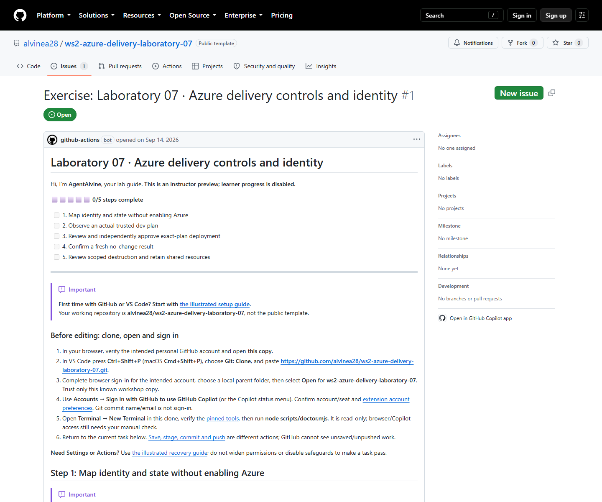

# Lab 07 · Full workshop content for review

[Repository landing](../README.md) · [Complete setup](00-start-here.md) · [Simulation and verification](simulation.md)

This pack exposes the complete setup and all five activities in [the course manifest](../.github/agentalvine/course.json). It is a **static review copy**, not another exercise, bug-ticket list, or learner progress tracker. Lesson text is bounded by preservation markers; only Markdown relative links outside code fences are rebased. Commands, examples, and publisher attribution remain the lesson's own content.

> [!WARNING]
> The complete live lessons are visible for review, **not authorized for execution**. Both original cycles verified only offline identity study: **A 1/5; B 1/5**. `WORKSHOP_AZURE_ENABLED=false`; no protected `main`, completed cloud preflight, or cloud run was claimed. The public template remains inert.

## Learner route: one copy, one Exercise issue

1. Use the [complete setup guide](00-start-here.md) to create **one private copy**, clone its own URL, open that clone, and check tools and accounts. If the copy already exists, do not copy again. Offline study needs no earlier lab or Azure access.
2. Open the **Exercise** link in **your private copy's README**. This is the live issue to follow, not the source preview below.
3. Read the current activity. Make the real permitted edits, save, commit, and push; inspect actual Actions checks. Real PRs and independent reviews must follow the lesson's approved route, never a fabricated approval or an invented unprotected `main`.
4. **AgentAlvine validates actual events and updates the SAME issue body**, including progress, feedback, and the next activity. Refresh that issue rather than making a ticket per activity.
5. Actions implements AgentAlvine and the checks; it is **not a replacement for the issue-based learner experience**. Live delivery additionally requires the instructor's separate authorization and real protected-environment controls.

Editing checkboxes never awards work and never authorizes Azure. Do not create evidence PRs, submit run IDs, or use a recovery workflow to bypass a live prerequisite. The [catalogue](https://github.com/alvinea28/ws2-workshop-catalogue) is only a directory of independent laboratories.

**Recovery only if the Exercise is missing:** first inspect startup and [troubleshooting](../docs/troubleshooting.md#agentalvine-or-the-exercise-is-missing). In the actual private copy, use **Actions → AgentAlvine → Run workflow → Check progress**, selecting that copy's **actual default branch** (normally `dev`). Then open the issue from its README. Do **not** choose **Preview** for a learner, run trusted delivery for startup, invent an issue, or widen permissions. An existing issue with pending live work stays pending until its genuine prerequisites are met.

## Complete activity sequence and original A/B status

Both original cycles were run on **2026-09-08**. “Verified” refers to the corresponding original private Exercise checkpoint, not completion in a new learner copy or the public source.

| Activity | Complete lesson | Cycle A | Cycle B |
| --- | --- | --- | --- |
| Setup | [Full first-time setup](00-start-here.md) | Guidance; not a progress checkpoint | Guidance; not a progress checkpoint |
| 01 | [Map identity and state without enabling Azure](activity-01.md) | Verified offline | Verified offline |
| 02 | [Observe an actual trusted dev plan](activity-02.md) | Pending instructor/cloud prerequisites | Pending instructor/cloud prerequisites |
| 03 | [Review and independently approve exact-plan deployment](activity-03.md) | Pending real plan, independent review and apply | Pending real plan, independent review and apply |
| 04 | [Confirm a fresh no-change result](activity-04.md) | Pending applicable deployment and follow-up | Pending applicable deployment and follow-up |
| 05 | [Review scoped destruction and retain shared resources](activity-05.md) | Pending reviewed live cleanup and inventory | Pending reviewed live cleanup and inventory |

See [simulation.md](simulation.md) for whole-lab counts, rejection boundaries, and the instructor handoff. Fixtures and mocks cannot complete the four live activities.

## Live public source preview — read-only, not learner progress

Open [public source Exercise #1](https://github.com/alvinea28/ws2-azure-delivery-laboratory-07/issues/1) to review the real instructor **Preview**. The **2026-09-14 read-only GitHub observation** confirmed a successful Preview workflow and **step 0, with 0/5 participant progress**. That source issue never becomes a learner's progress record; after copying, follow the Exercise link in your own README. “Live” here means a real GitHub page, **not live Azure delivery**.

*Captured on 2026-09-14 from the actual public GitHub Exercise #1: read-only instructor Preview, step 0 (0/5). [images/provenance.json](images/provenance.json) records the PNG SHA-256 and exact capture timestamp. This current source Preview is not a September 8 participant screenshot, either private 1/5 outcome, or Azure proof.*

See the separate [fresh local verification results](simulation.md#fresh-2026-09-14-verified-results) for command-output evidence, not participant progress.

Original private simulation records, immutable revisions, and actual offline Actions evidence are linked through the [private Lab 07 review](https://github.com/alvine-aurelio-org/ws2-public-rebuild-20260908-evidence/blob/dev/full-ws-content/lab-07/README.md). Screenshots supplement those records; they do not replace them.
