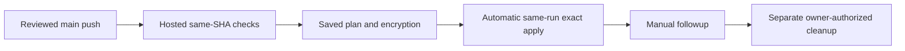

# Lab 07 · Activity 02 — Observe an actual trusted dev plan

[Review index](README.md) · [Previous activity](activity-01.md) · [Next activity](activity-03.md) · [Simulation evidence](simulation.md)

> [!NOTE]
> **Review copy, not a second progress tracker.** The complete canonical lesson follows. Learners follow the live **Exercise issue in their own private copy**, opened from that copy's README; AgentAlvine updates the same issue body. The public source preview awards no learner progress. This live activity remains blocked until genuine instructor prerequisites are met.

<!-- FULL-WS-LESSON:START -->
# Lab 07 · Step 2 — Observe a real instructor-enabled dev plan

**Goal:** Observe the real plan from an approved main push and automatic exact-plan apply in that same run. Planning success alone is not deployment or Azure authorization.

| Working context | Selection |
| --- | --- |
| Repository / branch | One approved **private** writer / current protected `main` |
| Files | Read [module-lock.json](../module-lock.json) and [environments/dev/main.tf](../environments/dev/main.tf); no edits |
| Workflow | **Trusted dev delivery (instructor enablement required)** |
| Tools / event | Node **24.16.0**, Terraform **1.16.1**, AzureRM **5.4.0** / `push` to `main` selects `deploy` |

> [!WARNING]
> **Public templates remain inert. No manual deployment reviewer is required.** Only real scope/budget/bootstrap authorization and readiness permit enablement of this exact private writer. No authoring cloud operations, learner enablement, local real backend/state access, identity creation or Copilot cloud tools.

Plain text: main push → credential-free validation → saved plan/encryption → automatic same-run exact-plan apply. **No second deploy dispatch or reviewer wait.** Delivery's manual choice is **followup only**. Cleanup has a separate workflow and explicit current-admin authorization; ordinary main never cleans up. Do not reuse an earlier run's artifact.

## Do

**Hands-on phase checklist — only after readiness:**

| Phase | Action / expected result |
| --- | --- |
| Construct first | Step 1: VS Code untitled YAML, header/preflight/validation/plan/apply/followup/drift, one complete canonical save while false; local checks and current-SHA CI pass |
| Inspect, do not invent | Owner checks **Settings → Rules / Environments / Actions variables**, secret names and runner access; authorizes target, budget/currency, lifetime and bootstrap; verifies OIDC/state/leases/keys/module App |
| Merge and observe | Author's checks-passing PR into ready protected main starts same-SHA validation, saved-plan encryption and automatic exact-plan apply; no second deploy button |
| Verify the lifecycle | Actual Azure configuration, then an approved benign HCL update with no replacement/same IDs, fresh followup exit 0 and separately authorized admin cleanup; [detailed activity](../docs/workflow-authoring.md#6-hands-on-verify-configuration-and-make-a-benign-update) |

### 1. Confirm every prerequisite with the instructor

Use [instructor preflight](../docs/instructor-preflight.md) and [delivery configuration](../docs/delivery-configuration.md), not an Exercise checkbox, to establish:

| Required boundary | Instructor confirmation |
| --- | --- |
| Writer and code | Private non-template **alvine-aurelio-org/ws2-sim-20260921-azure-delivery-laboratory-07**, ID **1379149907**; protected current `main`; actual merged-PR association; approved sandbox/revision; wrong IDs/public/templates fail |
| Authoring and validation | [Required Step 1 tutorial](../docs/workflow-authoring.md) completed while disabled; current PR checks; hosted delivery validation checks out `${{ github.sha }}` before `plan` can start |
| Identities | Distinct `AZURE_PLAN_CLIENT_ID` / `AZURE_APPLY_CLIENT_ID`: workload-RG Reader / Contributor; exact authorized OIDC subjects |
| Backend | Approved private account/container/key and runner DNS/routes; both identities have container-scoped **Storage Blob Data Contributor** for leases |
| Concurrency | One writer; state-specific `WS2_STATE_LOCK_ID`; no cancellation of active writers; blob locking enabled |
| Runner | Clean restricted allowed-workflow runner, labels `self-hosted`, `linux`, `x64`, `ws2-trusted`; PRs cannot use it |
| Environments | `dev-plan` / `dev-apply`: explicit branch-`main`-only policies; **no Required reviewers**; administrator bypass disabled |
| Owner authorization | Approved RG/region/ranges, budget/currency, lifetime and explicit bootstrap authorization; separately assigned cleanup owner |
| Inputs and transport | Existing `WORKLOAD_RG`; approved `WORKLOAD_INPUTS_JSON` and locks; narrowly scoped module transport, never PR credentials |
| Encryption | Public key configured; decryption key restricted to `dev-apply`; any owner recovery/inspection escrow is private, not a reviewer gate |

Missing any requirement? Keep `WORKSHOP_AZURE_ENABLED=false`, record **BLOCKED**, and stop. Consult [configuration status](../docs/delivery-configuration.md); these instructions are not a new settings or Azure readback. Never invent values, open a PR into nonexistent main or create it while unready. The owner establishes protected main while disabled only after baseline/readiness review. Public-template maintenance stays on dev; unapproved private copies remain offline and must not repin the allowlist.

### 2. Observe the reviewed main push — do not dispatch deploy

Finish [the required workflow-authoring task](../docs/workflow-authoring.md) on `lab/workflow-authoring` first. The existing complete workflow is the reference baseline, not an excuse to skip construction or to install a duplicate. Keep delivery disabled until the instructor has separately authorized the live window.

Coordinate one reviewed PR merge into protected `main`. If the original authoring PR was merged while disabled, its skipped run is not proof: a later authorized reviewed main push is required. In the approved copy, inspect **Code → main → latest commit**, then **Actions → Trusted dev delivery (instructor enablement required)** and open the run created by that push:

| Run field | Value / meaning |
| --- | --- |
| Event / branch | **push / main** — trusted reviewed code, not default `dev` or a PR head |
| SHA / attempt | Exact current main commit / **1** |
| Operation | `deploy`, selected by the push policy; the same run automatically applies the exact saved plan after scoped authorization |

Do not select **Run workflow** for deployment and never select **Re-run jobs**. Only **followup** remains in delivery's manual menu; [dedicated cleanup](activity-05.md) accepts a required authorization string, no operation input. Scheduled drift reports without applying, but needs the owner's deliberate protected-main default choice when ready; the offline default dev is not changed automatically. Read [Step 3's exact-plan observations](activity-03.md#4-observe-scoped-authorization-and-exact-plan-application) before the first enabled merge.

*REFERENCE — GitHub, CC BY 4.0; CodeQL is an example label, not this workflow. [Attribution](../docs/images/NOTICE.md).*

### 3. Inspect actual execution and protected artifacts

Require **Verify scoped dev deployment policy**, then **Validate reviewed delivery revision**, then **Trusted dev plan**, to succeed. Validation runs `npm test`, `kit:check`, `workflow:check` and the existing backend-disabled provider-mocked learner helper on hosted Ubuntu, without secrets/OIDC/trusted-runner access. Failure stops before privileged planning; an unrelated green PR run is not a substitute for this exact-SHA dependency.

In **Summary**, compare source/module/state/run/attempt/operation and inspect creates, updates, deletes, replacements and output caveats. **Apply exact dev saved plan** automatically consumes this run's encrypted saved plan after fresh identity/live-rules/current-main/merged-PR/same-run checks. No approvals API is used. Destroy or replacement actions on regular pushes fail. Never treat issue progress as authorization or publish plaintext plans.

| Terraform detailed exit | Meaning |
| --- | --- |
| `0` | Valid no-change plan; not the later follow-up checkpoint |
| `2` | Valid plan with changes; not approval |
| `1` | Error; stop |

Only an **AES-256-GCM / RSA-OAEP encrypted envelope** may be uploaded. Its run-specific identity and separate saved-plan/manifest SHA-256 digests bind review. Private readers can download ciphertext; privacy alone is not decryption protection. Plans expire after **2 hours**; **1 day** artifact retention does not extend validity. No keys, tokens, raw state, decrypted plans or sensitive screenshots in Git, issues or Chat. Sanitized addresses are not property-level review.

### 4. Check the Exercise gate

**Expected:** Refresh the existing issue after the **whole run completes**. AgentAlvine requires the actual same-repository delivery run on `main`, current observed SHA, attempt **1**, created after course start and no earlier than the preceding checkpoint, with **Trusted dev plan** successful. A successful plan inside an unfinished run does not satisfy that completed-run gate. Old, queued, skipped or fixture jobs do not count; no run-ID submission, evidence PR or manual progress edit.

The metadata observer accepts eligible push, dispatch and schedule records; it is not push-only or an authorization engine. This lesson deliberately uses **push / main**. After this checkpoint is recorded, Step 3's explanation-note PR creates a **later main-push run** with its own fresh plan/apply; the earlier run cannot satisfy a later checkpoint's time boundary. Five steps remain; original Step 1 completion and historical scores are preserved. Step 5 now follows the actual dedicated cleanup workflow.

The current driver checks scoped output IDs after apply, not real Azure configuration. Instructor-observed configuration and later cleanup inventory remain separate required live verification, never inferred from tests or job names.

**Recovery:** Comment **BLOCKED**, the sanitized failure category and instructor next action. Resolve missing access/runner/lease controls without public-backend workarounds, unlocks or privilege expansion; then use a new authorized run, never a credentialled rerun.

**Next:** [Step 3: automatic exact-plan deploy](activity-03.md). Offline success cannot unlock it.
<!-- FULL-WS-LESSON:END -->

## Original Cycle A/B outcome — 2026-09-08

- **Cycle A: pending genuine instructor prerequisite.** No protected `main` or completed cloud preflight existed; no actual trusted dev plan was run.
- **Cycle B: pending genuine instructor prerequisite.** The fresh copy also remained offline at **1/5**, with `WORKSHOP_AZURE_ENABLED=false` and no cloud run.
- Neither the accepted identity note, mocks, the source preview, nor a screenshot substitutes for this activity's actual eligible trusted job.

See [simulation.md](simulation.md) for the original records and explicit live-work boundary. No per-activity test count or live success is claimed.

[Previous activity](activity-01.md) · [Review index](README.md) · [Next activity](activity-03.md)
