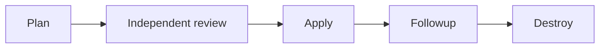

# Lab 07 · Activity 02 — Observe an actual trusted dev plan

[Review index](README.md) · [Previous activity](activity-01.md) · [Next activity](activity-03.md) · [Simulation evidence](simulation.md)

> [!NOTE]
> **Review copy, not a second progress tracker.** The complete canonical lesson follows. Learners follow the live **Exercise issue in their own private copy**, opened from that copy's README; AgentAlvine updates the same issue body. The public source preview awards no learner progress. This live activity remains blocked until genuine instructor prerequisites are met.

<!-- FULL-WS-LESSON:START -->
# Lab 07 · Step 2 — Observe a real instructor-enabled dev plan

**Goal:** Observe a real plan without mistaking planning success for apply approval.

| Working context | Selection |
| --- | --- |
| Repository / branch | One approved **private** writer / current protected `main` |
| Files | Read [module-lock.json](../module-lock.json) and [environments/dev/main.tf](../environments/dev/main.tf); no edits |
| Workflow | **Trusted dev delivery (instructor enablement required)** |
| Tools / operation | Node **24.16.0**, Terraform **1.16.1**, AzureRM **5.4.0** / `plan` |

> [!WARNING]
> **Public templates remain inert. Live Lab 07 is not solo.** Only instructor authorization enables this private writer after preflight. No authoring cloud operations, learner enablement, local real backend/state access, identity creation or Copilot cloud tools.

Plain text: plan → independent review → apply → followup → destroy. **Deploy and destroy each create their own fresh plan and require separate independent review**; this plan-only artifact is not reusable.

## Do

### 1. Confirm every prerequisite with the instructor

Use [instructor preflight](../docs/instructor-preflight.md) and [delivery configuration](../docs/delivery-configuration.md), not an Exercise checkbox, to establish:

| Required boundary | Instructor confirmation |
| --- | --- |
| Writer and code | Exact private copy; protected current `main`; reviewed merged-PR association; approved sandbox/revision |
| Identities | Distinct `AZURE_PLAN_CLIENT_ID` / `AZURE_APPLY_CLIENT_ID`: workload-RG Reader / Contributor; exact authorized OIDC subjects |
| Backend | Approved private account/container/key and runner DNS/routes; both identities have container-scoped **Storage Blob Data Contributor** for leases |
| Concurrency | One writer; state-specific `WS2_STATE_LOCK_ID`; no cancellation of active writers; blob locking enabled |
| Runner | Clean restricted allowed-workflow runner, labels `self-hosted`, `linux`, `x64`, `ws2-trusted`; PRs cannot use it |
| Environments | `dev-plan` / `dev-apply`: explicit branch-`main`-only policies; required independent `dev-apply` reviewers; self-review prevented; administrator bypass disabled |
| Reviewer | Neither run actor/triggering actor nor PR/deployed code author; required licensing/access actually available |
| Inputs and transport | Existing `WORKLOAD_RG`; approved `WORKLOAD_INPUTS_JSON` and locks; narrowly scoped module transport, never PR credentials |
| Encryption | Public key configured; decryption key restricted to `dev-apply` and approved reviewer escrow |

Missing any requirement? Keep `WORKSHOP_AZURE_ENABLED=false`, record **BLOCKED**, and stop. Never invent `main`, widen roles or replace independent approval with self-checking.

### 2. Request one new plan

In the approved copy, inspect **Code → main → latest commit**. Then **Actions → Trusted dev delivery (instructor enablement required) → Run workflow**:

| Form field | Value / meaning |
| --- | --- |
| Use workflow from | **Branch: main** — trusted reviewed code, not default `dev` |
| operation | `plan` — plan only, no apply |
| Run workflow | Creates a **new run**, attempt **1**; verify its SHA matches current main |

Never select **Re-run jobs**. Once enabled, a main push can request `deploy`; scheduled `drift` is also distinct from this manual plan.

*REFERENCE — GitHub, CC BY 4.0; CodeQL is an example label, not this workflow. [Attribution](../docs/images/NOTICE.md).*

### 3. Inspect actual execution and protected artifacts

Require **Verify instructor gate configuration**, then **Trusted dev plan**, to succeed. In **Summary**, compare source/module/state/run/attempt/operation and inspect creates, updates, deletes, replacements and output caveats.

| Terraform detailed exit | Meaning |
| --- | --- |
| `0` | Valid no-change plan; not the later follow-up checkpoint |
| `2` | Valid plan with changes; not approval |
| `1` | Error; stop |

Only an **AES-256-GCM / RSA-OAEP encrypted envelope** may be uploaded. Its run-specific identity and separate saved-plan/manifest SHA-256 digests bind review. Private readers can download ciphertext; privacy alone is not decryption protection. Plans expire after **2 hours**; **1 day** artifact retention does not extend validity. No keys, tokens, raw state, decrypted plans or sensitive screenshots in Git, issues or Chat. Sanitized addresses are not property-level review.

### 4. Check the Exercise gate

**Expected:** Refresh the existing issue after completion. AgentAlvine requires the actual same-repository delivery run on `main`, current observed SHA, attempt **1**, created after course start and no earlier than the preceding checkpoint, with **Trusted dev plan** successful. Old, queued, skipped or fixture jobs do not count; no run-ID submission, evidence PR or manual progress edit.

**Recovery:** Comment **BLOCKED**, the sanitized failure category and instructor next action. Resolve missing access/runner/lease controls without public-backend workarounds, unlocks or privilege expansion; then use a new authorized run, never a credentialled rerun.

**Next:** [Step 3: independently reviewed deploy](activity-03.md). Offline success cannot unlock it.
<!-- FULL-WS-LESSON:END -->

## Original Cycle A/B outcome — 2026-09-08

- **Cycle A: pending genuine instructor prerequisite.** No protected `main` or completed cloud preflight existed; no actual trusted dev plan was run.
- **Cycle B: pending genuine instructor prerequisite.** The fresh copy also remained offline at **1/5**, with `WORKSHOP_AZURE_ENABLED=false` and no cloud run.
- Neither the accepted identity note, mocks, the source preview, nor a screenshot substitutes for this activity's actual eligible trusted job.

See [simulation.md](simulation.md) for the original records and explicit live-work boundary. No per-activity test count or live success is claimed.

[Previous activity](activity-01.md) · [Review index](README.md) · [Next activity](activity-03.md)
