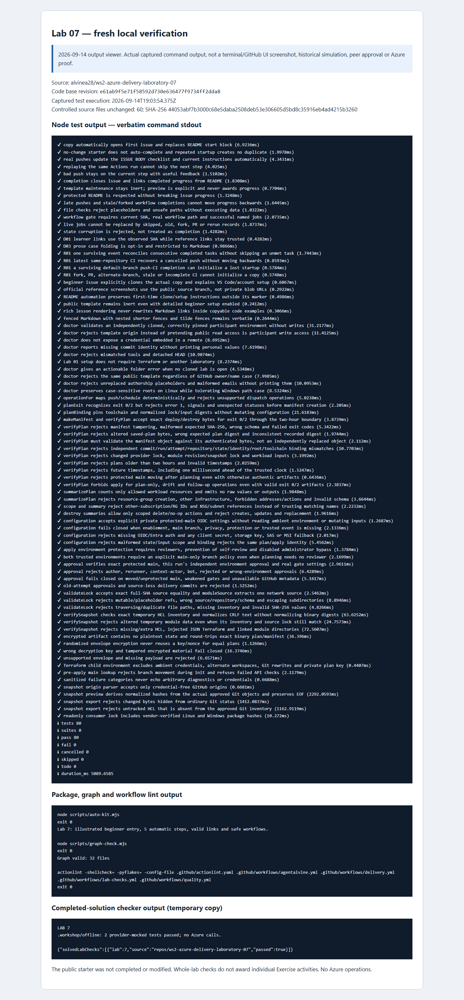

# Lab 07 · Original simulation evidence and new review captures

[Review index](README.md) · [Complete setup](00-start-here.md) · [Repository landing](../README.md)

## Dates and evidence scope

- **Original Cycle A: 2026-09-08. Original Cycle B: 2026-09-08.** These were separate fresh private learner copies, not the public source preview.
- **New review/capture date: 2026-09-14.** Fresh local checks passed and the review images were captured; neither is a third participant cycle. Results and PNG provenance are recorded separately below.
- A read-only GitHub observation rechecked the original private completion arrays and immutable CI bindings without changing progress. It separately confirmed the successful public source **Exercise #1** instructor Preview at **step 0, with 0/5 participant progress**. Preview workflow success is not cloud execution.
- Primary proof: [private Lab 07 review and original record links](https://github.com/alvine-aurelio-org/ws2-public-rebuild-20260908-evidence/blob/dev/full-ws-content/lab-07/README.md). The [original public summary](../docs/daily%20work%20report/2026-09-08.md) records the published per-lab totals. Raw private simulation logs remain private.

## Per-activity original outcomes

| Activity | Cycle A | Cycle B | What the status establishes / genuine prerequisite |
| --- | --- | --- | --- |
| [01 · Identity and state map](activity-01.md) | Verified offline | Verified offline | Pushed identity study accepted; supplied snapshot/offline route used. No Azure enablement. |
| [02 · Actual trusted plan](activity-02.md) | Pending | Pending | No protected `main` or completed instructor/cloud preflight; no actual trusted plan. |
| [03 · Exact-plan review and apply](activity-03.md) | Pending | Pending | Real fresh plan, independent encrypted-plan approval, and successful apply remain required. |
| [04 · Fresh no-change](activity-04.md) | Pending | Pending | Needs the applicable real deployment and a separate successful no-change run. |
| [05 · Scoped cleanup](activity-05.md) | Pending | Pending | Needs new reviewed destruction, actual cleanup, and instructor retained-resource confirmation. |

Both private guides reached **1/5**. **`WORKSHOP_AZURE_ENABLED=false`; no cloud run occurred.** No protected `main` or cloud preflight was manufactured. Identity study, mock tests, fixtures, or a green issue checkbox cannot satisfy a live job or authorize delivery.

## Original test accounting — whole lab, not per activity

| Original cycle | Lab 07 progress | Node passes | Mocked case + fixture passes |
| --- | --- | --- | --- |
| A · 2026-09-08 | 1/5 | 77 | 2 |
| B · 2026-09-08 | 1/5 | 80 | 2 |

These totals belong to each **whole-lab cycle**, not to each activity. Passing offline Node/fixture checks cannot be relabelled as planning, apply, no-change, or destruction in Azure.

Across **all eight labs**, each original cycle reached **25/33 activities** with **five complete laboratories**. Cycle A recorded **301 Node** passes; Cycle B recorded **325 Node** passes. Each recorded **229 mocked case/fixture passes, excluding repeats**. These historical totals are not new 2026-09-14 verification results.

## Legitimate rejection coverage and limits

The [current course configuration](../.github/agentalvine/course.json), canonical lessons, [instructor preflight](../docs/instructor-preflight.md), and [delivery configuration](../docs/delivery-configuration.md) define these boundaries. This is a review of required rejection behavior, **not a claim that cloud rejection paths or every fixture were freshly exercised, or that live configuration was verified**.

| Boundary | Rejected or insufficient evidence | Grounding |
| --- | --- | --- |
| Offline study | Missing role/field names, `TODO`, or a fabricated dependency pin; the note is not live readiness | [Activity 01](activity-01.md) and manifest file checks |
| Live readiness | Public source, missing protected `main`, disabled instructor gate, absent sandbox/identities/private backend/restricted runner, missing independent approval protections | [Activity 02](activity-02.md) and instructor documents; both original cycles stopped honestly |
| Actual job eligibility | Wrong repository/branch/SHA, pre-course or pre-checkpoint run, attempt other than 1, skipped required jobs, old baseline run, or fixture metadata | Activities [02](activity-02.md), [03](activity-03.md), [04](activity-04.md), [05](activity-05.md) |
| Exact-plan mutation | Self/author/initiator approval, administrator bypass, stale/moved `main`, changed bindings/digests, expired plan, plaintext evidence exposure, or silently replanning | [Activity 03](activity-03.md); **2 hours** validity is distinct from **1 day** encrypted-artifact retention |
| Fresh no-change | Changes exit code `2`, error `1`, skipped confirmation, old apply summary, or earlier-cycle jobs after watched inputs change | [Activity 04](activity-04.md); `repeatOnChange` remains unchanged |
| Scoped cleanup | Old deploy approval, unreviewed destruction, shared-resource deletion, nonempty managed workload, or inferred retained-resource ownership | [Activity 05](activity-05.md); real workload cleanup and human inventory confirmation are separate |

The live course needs real successful **Trusted dev plan**, **Apply reviewed dev plan**, **Confirm no-change**, and **Destroy reviewed dev plan** jobs at their appropriate new checkpoints. None was claimed in the original offline simulations. PR validation stays without Azure/OIDC/state access; no rule was relaxed for this pack.

## Fresh 2026-09-14 verified results

Source-quality checks and the real completed-solution fixture checker passed, with the offline solution exercised in an isolated **temporary copy**. The pinned workshop toolchain was Terraform **1.16.1**, AzureRM **5.4.0**, and terraform-docs **0.24.0** for documentation checks. No Azure operations occurred.

| Check | Result |
| --- | --- |
| Node tests | 80 passed; 0 failed; 0 skipped |
| auto-kit | Passed |
| graph | Passed |
| actionlint | Passed |
| Completed-solution checker | Passed — offline fixture in an isolated temporary copy |

These are fresh whole-lab checks, not per-activity proof or new mock totals. The [fresh command record (organization access required)](https://github.com/alvine-aurelio-org/ws2-public-rebuild-20260908-evidence/blob/dev/evidence/review-2026-09-14/local/lab-07.json) is separate from the original A/B records; their progress and counts are unchanged. Passing offline fixtures does not complete any of the four live activities or the instructor preflight.

## Screenshots: distinguish observation from reconstruction

Original step-by-step browser screenshots **were not taken on 2026-09-08**. Private activity images were captured on **2026-09-14** from a labelled local viewer of preserved original records, **not original-day GitHub UI**. The [source preview image](README.md#live-public-source-preview--read-only-not-learner-progress) is a separate actual public GitHub capture of read-only Exercise #1 at step 0 (0/5), not learner completion or Azure execution.

*Captured on 2026-09-14 from a labelled local output viewer of the actual fresh commands, including the completed-solution offline fixture check in a temporary copy. This is not terminal UI, historical GitHub UI, a third participant cycle, or human/live approval. [images/provenance.json](images/provenance.json) records both public PNG SHA-256 digests and exact capture timestamps.*

Screenshots are secondary to original immutable records and actual offline Actions evidence in the [private review](https://github.com/alvine-aurelio-org/ws2-public-rebuild-20260908-evidence/blob/dev/full-ws-content/lab-07/README.md). Publisher reference screenshots retain their attribution and do not depict a successful participant deployment.

## Remaining work and non-claims

- Keep the offline identity study available to the instructor; live work remains blocked pending real protected `main`, sandbox/federation/state, restricted runner, encrypted-plan review, and independent approval.
- No actual plan, apply, follow-up, destruction, cloud health, or retained-resource inventory was established. Optional later capstone delivery needs its own reviewed release/pin and fresh cycle in the **same single writer**.
- No GUI sign-in, MFA completion, Copilot-seat assignment, or human approval is inferred from automation.
- No Azure deployment, identity creation, state access, subscription change, or live cloud run occurred in this documentation work. Cloud health is **not tested**.
- The captured images and passing local checks do not complete the deferred instructor/cloud gates or authorize Azure delivery.
